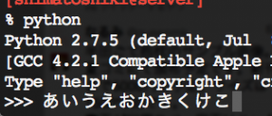

## 環境

*   Mac OSX 10.8.4
*   Python 2.7.5 (Homebrewでインストール)
*   Python 3.3.2でも確認
*   readline 6.2.4(Homebrew)

[Mac OSXのPythonのインタラクティブシェルorインタプリタで日本語が入力出来なくてつらい « haya14busa][1]

やっと解決しました。まさかzsh調べてる過程でPythonの問題を解決できるとは思わなかった。

## 解決法

やっぱりreadline / GNU readlineの問題でした。readlineは~/.inputrcを読み込むようで、そこに下記の記述でPythonのインタプリタで(一応)日本語が打てるようになります。

~/.inputrc

    kanji-code utf-8
    
    # Enable 8bit input
    set meta-flag on
    set input-meta on
    
    # Turns off 8th bit stripping
    set convert-meta off
    
    # Keep the 8th bit for display
    set output-meta on
    
    set enable-keypad on
    

いまいち.inputrcの再読み込みのやり方わからなかったんで、シェルごと再起動させて調べてました。

readlineの環境としてはHomebrewでインストールしたreadline6.2.4。PythonのDependenciesに含まれてるので、普通にbrew install pythonしてれば入ってますeasy_install readlineやpip install readlineはしてもしなくても変わりませんでした。特に後者はディレクトリの配置が優先されないのかそもそも機能してるか怪しいです。readlineをpipのみで入れるとimportでエラー吐くので。

とにかく、~/.inputrcに上記の記述でひとまず日本語を打つときに「ガッガッ」と警告音ならされて文字が消えることなく、入力できるはずです。

## バグ挙動

> 訳注: IDLE をはじめ、ほとんどの Python 2 用のインタラクティブシェルは、非ASCII 文字を含む Unicode リテラルを利用することができません。このサンプルを実行するには、インタプリタ内蔵のインタラクティブシェルを利用する必要があります。 この問題は Python 3 では解決されています。
> 
> &#8211; <cite><a href="http://docs.python.jp/2/tutorial/introduction.html#unicode">3. 形式ばらない Python の紹介 — Python 2.7ja1 documentation</a></cite>

そもそも公式ドキュメントで書いてある通り、インタプリタでの日本語の使用はあまりできないっぽいです。今回解決した結果も例に漏れずバクがあります。

まず最初に書いたURL -> [Mac OSXのPythonのインタラクティブシェルorインタプリタで日本語が入力出来なくてつらい « haya14busa][1] の記述と同様Pythonインタプリタで使用される文字エンコーディングをすべて&#8217;utf-8&#8242;に変えます。

~/.zshrc

    export PYTHONSTARTUP=~/.pythonstartup
    export PYTHONIOENCODING='utf-8'
    

~/.pythonstartup

    import sys
    reload(sys)
    sys.setdefaultencoding('utf-8')
    
    import codecs
    
    sys.stdout = codecs.getwriter('utf_8')(sys.stdout)
    sys.stdin = codecs.getreader('utf_8')(sys.stdin)
    

エンコーディングを変えた環境で開発するのは配布の際などに不具合をきたす可能性があがってよくないですが、日本語扱うためにはある程度しかたないです。そもそもインタプリタってちょっと気軽に確認したいってときに使うことが多いと思うので。また普通にスクリプトを実行する際は上記の記述はまったく関係ないはずなので問題ないと思います。

### で…実行すると

    % python
    Python 2.7.5 (default, Jul  8 2013, 03:25:24) 
    [GCC 4.2.1 Compatible Apple LLVM 4.2 (clang-425.0.28)] on darwin
    Type "help", "copyright", "credits" or "license" for more information.
    >>> a = 'こんにちは'
    >>> type(a)
    <type 'str'>
    >>> len(a)
    15
    >>> print a
    こんにちは
    >>> b = u'こんにちは'
    >>> type(b)
    <type 'unicode'>
    >>> len(b)
    15
    >>> print b
    こんにちは
    

aに関してはいいですよ………問題は**b**です。len(b)が15ってなんだよ！ぉこだよ！？printで文字化けしてんじゃねーよ！！！

これじゃあ日本語入力できても結局確認にすら使えないですよね。そこでちょっと強引な解決法として

    >>> c = unicode(a,'utf-8')
    >>> type(c)
    <type 'unicode'>
    >>> len(c)
    5
    >>> print c
    こんにちは
    >>> c[1:3]
    u'\u3093\u306b'
    >>> print c[1:3]
    んに
    

これだと文字列のスライスもできてますし、ちょっと日本語関係のコードを確認するときは一旦str型で入力したものをunicode(text,&#8217;utf-8&#8242;)すればちゃんと動くってことですね。これでひとまず解決！！！

ところでu&#8221;テキスト&#8221;とunicode(&#8220;テキスト&#8221;,&#8217;utf-8&#8242;)の違いってなんなんだろうか。

u\_quote\_and_unicode.py

    # coding:utf-8
    print u"てきすと" == unicode("てきすと",'utf-8') # True
    

シェルでなくスクリプトファイルで確認するとTrueだったので違いはないのかな？

ちなみにPython3のインタプリタで試した所、無駄なこと一切せず動きます。文字コードに関しては3に移行したいと思った。ついでに言うとPyrhon2.6から実装されたfrom **future** import unicode_literalsすると全部u&#8221;てきすと&#8221;の扱いになるので今回は逆効果です。

あとインタプリタ上で日本語入力ができてるように見えますけど、内部？では1文字の「あ」ではなくカーソル3つ分くらいの長さを持ってるので、カーソルを移動させたり、消去すると表示がバグります。いったん何文字か売ってカーソルを左に移動させてからもう一度右にするとわかりやすいです。……ということで日本語部分を書き直すなら文頭から全部書きなおすようにしたほうがいいですね。
 最初に数文字打って……… 

[][2] カーソルを左右に移動させると……… [][3] 

 [1]: http://haya14busa.com/cannot-input-japanese-in-python-interpreter/
 [2]: ../images/misc/wp/2013/07/Screen-Shot-2013-07-08-at-9.08.49-AM.png
 [3]: ../images/misc/wp/2013/07/Screen-Shot-2013-07-08-at-9.09.36-AM.png
