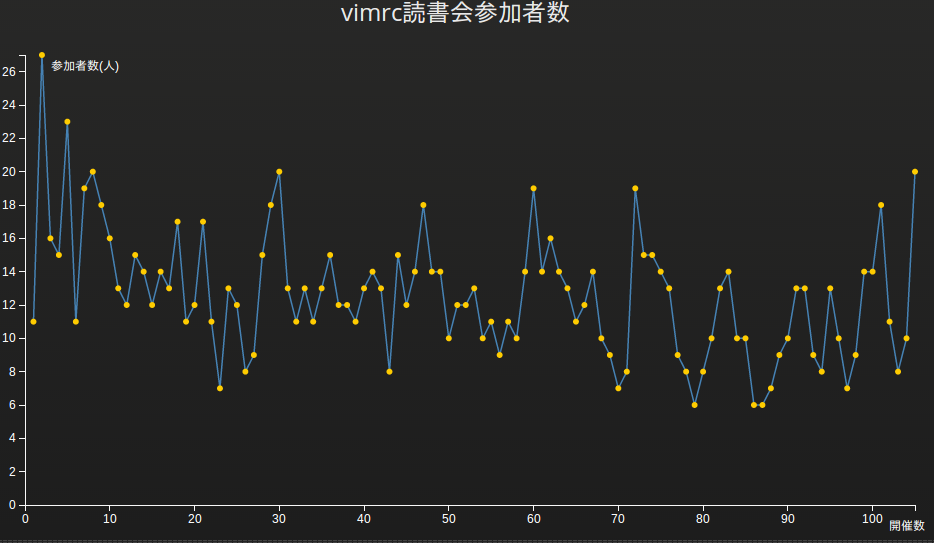
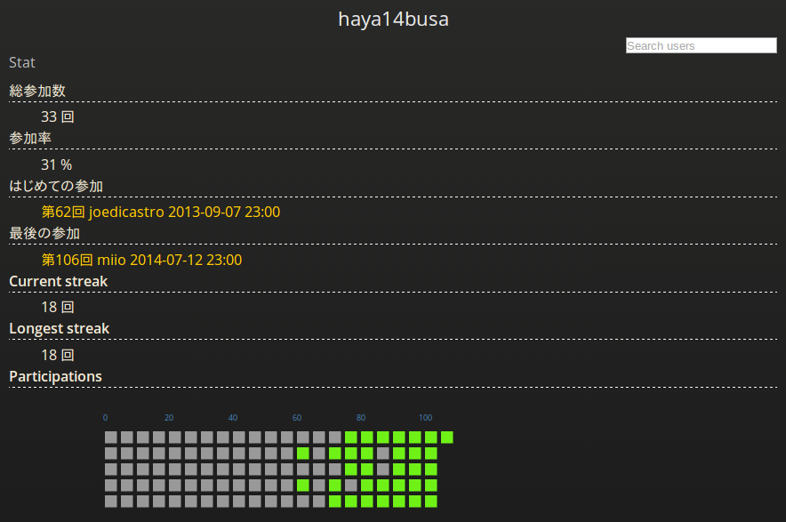
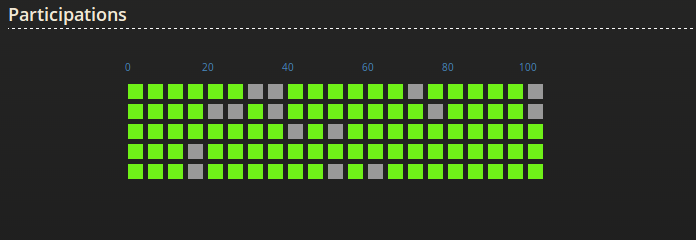

vimrc読書会Statを作りました!
----------------------------

#### [vimrc読書会 Stat](http://vim-jp.org/reading-vimrc/stat/#/)


#### 参加者Stats: [vimrc読書会 Stat - haya14busa](http://vim-jp.org/reading-vimrc/stat/#/u/haya14busa)


#### GitHub Contributionグラフのイミテーション


vimrc読書会2周年
----------------

先日の 2014/07/12(土) に開催された[第106回 vimrc読書会](http://vim-jp.org/reading-vimrc/archive/106.html)ですが、
なんと 2012/07/10(火) に開催された[第1回 vimrc読書会](http://vim-jp.org/reading-vimrc/archive/001.html)から数えて
**2周年** の回でした。 めでたい!

と、まぁそういうめでたい節目(最近100回越えもあった)でもあり、vimrc読書会のアーカイブデータは現在データ化されていて利用しやすい形にもなっていたので、せっかくなので[d3.js](http://d3js.org/)と[AngularJS](https://angularjs.org/)で遊んでみました。

両方全く触ったことがなかったのでいろいろと改善したいところがそれはもうたくさんありますが、今までのデータの視覚化、ついでにこれからvimrc読書会に参加するのがチョット楽しくなるようなGitHubの草(Contributions graph)のイミテーションも作ったりして楽しかったです。

実装したStatについて
--------------------
大きく分けると3つです。

### 1. vimrc読書会参加者数推移グラフ


- 使用ライブラリ: [D3.js - Data-Driven Documents](http://d3js.org/)
- 参考: d3 sampleの [Line Chart](http://bl.ocks.org/mbostock/3883245)
- URL: [vimrc読書会 Stat](http://vim-jp.org/reading-vimrc/stat/#/)

Statページの一番上にどーんと参加者数推移のグラフを載せるようにしました。
ちょっと悪目立ちしてるレベルなくせにベースの[Line Chart](http://bl.ocks.org/mbostock/3883245)にちょっと機能を加えただけという代物です。
縦軸が参加人数、横軸が開催数になっていて、ドットにマウスオーバーすると情報が見えたり、クリックするとアーカイブページに飛べます。
(実は横幅が全部表示するにはギリギリで、あまりスケールしないようになっているのでそのうち改善できたらしたいです)

第2回が最高の27人参加だということが可視化されたり、最近の第105回で20人と結構な記録を出してるなーとわかったりしてちょっとおもしろい。
みんなでﾜｲﾜｲ参加して最高記録を塗りかえれるとアツイですね...!

d3に関しては、最初はbar chartでやろうと迷走していたりとグラフの選択とか結構難しかったけど、なかなかd3面白いなぁという印象を受けました。ただd3の知識はd3でしか生かせないようなつぶしが効かない印象も...? とはいっても,`svg`周りとかは汎用性高いし、視覚的に面白いものがつくれるのでd3やってみてよかったです。

### 2. vimrc読書会参加数ランキング
- 使用ライブラリ: [AngularJS](https://angularjs.org/)
- URL: [vimrc読書会 Stat](http://vim-jp.org/reading-vimrc/stat/#/)

`1`の`vimrc読書会参加者数推移グラフ`の下に、ずらずらーっとこれまでの全vimrc読書会参加者の参加者数ランキングを出しています。
初期の頃からvimrc読書会を支えてきた/参加してきた上位陣が圧倒的で[@thinca](https://twitter.com/thinca)さんに至っては脅威の皆勤賞で堂々の1位です。すごすぎる...

現状、参加者名が`3`の`参加者ごとのStatページ`へのリンクになっているという関係上,参加者全員分を表示していますが、今後StatのTopページはサマリーだけだして、ランキングとか別のページに分けるという仕様に変更するかもしれません。

Angularに関してはここでは単にデータをDOMに結び付けてるだけです。ベーシックに`ng-repeat`とか使ってみてデータバインディングの便利さを痛感しました。jQueryで頑張るとは何だったのか。

### 3. 参加者毎のStatページ


- 使用ライブラリ: [AngularJS](https://angularjs.org/) & [D3.js - Data-Driven Documents](http://d3js.org/)
- URL: [http://vim-jp.org/reading-vimrc/stat/#/u/{{username}}](http://vim-jp.org/reading-vimrc/stat/#/u/{{username}})
  - sample: [http://vim-jp.org/reading-vimrc/stat/#/u/haya14busa](http://vim-jp.org/reading-vimrc/stat/#/u/haya14busa)

Angularのrouting機能を使って、参加者毎の統計ページを作ってみました。
単純なこれまでの参加数などに加えて、GitHubの草をリスペクトした Current streak, Longest streakの情報や, streakのグラフをd3で作ってみました。例によって、それぞれのマスにマウスオーバーで情報表示とクリックでアーカイブページに飛ぶようになってます。

あと、自分が参加してない過去の読書会とか振り返りたいという要望がきっとあるみたいな妄想から、参加/参加してない読書会ごとのアーカイブを表示させてます。

グラフが見るからに手抜きでしょぼい感が拭いきれてないのが明白なんですが、機能的には割とよさ気な感じになったかなぁと思います。
というか個人的にGitHubの草を生やしたり、何かしら記録して頑張った感を可視化できるのが好きなんです。~~肝心の中身はあとからついてくると信じてる~~

連続参加とか参加率が可視化されて、すこしでもvimrc読書会に参加したいなーという助けになればそれはとっても嬉しいですね。ぜひぜひ連続参加を目指してみてください。
一回「hi」と発言するだけでも参加扱いになるのでROM勢の方もぜひ発言してみてください。かくいう僕も最初はROMばっかりしてましたが、やっぱり会話できるとベンリです。

この辺も後々改善できればしていくと思います。一応右上の検索ボックスで他の参加者のページに飛べる(補完も効くはず)ようになってたりするのですが、もっといいUI絶対あるよね...

Jekyll on GitHub pages
----------------------
Jekyll on GitHub pages と クライアントサイドMVなんちゃらで動的っぽいサイトがつくれて面白かったです。

### Template

注意点としてテンプレートのシンボルがJekyllのLiquidと、AngularでかぶるのでAngular側でテンプレートのシンボルを変更しておく必要があります。
今回は角括弧でこのように使えるようにしてみました。`[[ vimmutable ]]`

```javascript
var app = angular.module('myapp', []);
app.config([ '$interpolateProvider', function($interpolateProvider) {
    $interpolateProvider.startSymbol('[[').endSymbol(']]');
  }
]);
```
- 参考: [Angular and Liquid expressions in Jekyll - { always: 'coding' }](http://alwayscoding.ca/momentos/2013/10/09/angular-and-liquid-expressions-in-jekyll/)

### yamlデータをjsonでホスト
Jekyllは、特にGitHub Pagesなどのプラグインがない状態ではjsonのデータは基本つかえず、yamlでいろいろデータを書いておいて、そのデータを簡単に記事などに埋め込めるようになっているのですが、その性質をハックして無理やりjson形式に出力することができます。

やり方はjsonファイル作って、その先頭に空の Front-matter をおいて、あとはjsonをLiquid記法と交えてよしなに書いていくだけです。(自動化したい...)

Jekyllに検索機能を持たすという文脈で紹介されることが多いっぽいですが、yamlでデータをガンガンおいてる場合はjsonホストすると使いやすくなっておすすめです。

- 実例: https://github.com/vim-jp/reading-vimrc/blob/77c5570aefb2274ffcd846728f8d2deedd3bb4e6/json/archives.json
- 参考: [Simple Jekyll Searching - Alex Pearce](https://alexpearce.me/2012/04/simple-jekyll-searching/)

JSONデータ
----------
- http://vim-jp.org/reading-vimrc/json/archives.json
- http://vim-jp.org/reading-vimrc/json/next.json

アーカイブと、次回読むvimrcについてのjsonが上記URLで公開されているので使いたい方は使ってもいいと思います(たぶん)。
一応このJSONで[haya14busa/unite-reading-vimrc](https://github.com/haya14busa/unite-reading-vimrc)とか作ってみたりしました。

まとめ
------

d3もangularも初めてで未熟な部分が多々あったものの、割といいレスポンスをもらえて嬉しかったです...! [Lingrのvim部屋](http://lingr.com/room/vim)で `!vimrc-stat {username}` と打つと参加者統計ページへのリンクが返ってくるようになって便利。

最後になりましたが、宣伝です!!!

[vimrc読書会](http://vim-jp.org/reading-vimrc/)は毎週土曜日23:00から[LingrのVim部屋](http://lingr.com/room/vim)でオンラインでやっています。
参加すると、vim力がめちゃめちゃ上がるのでぜひぜひ参加して参加記録を伸ばしたりしましょう!お待ちしておりますよっ

