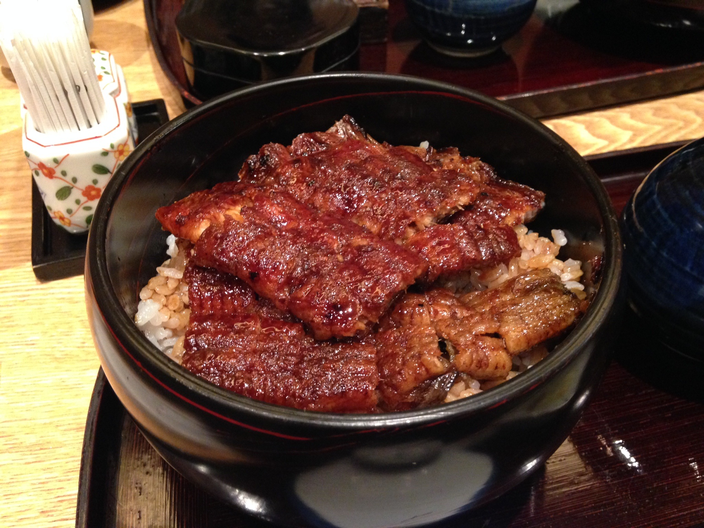

Nagoya.vimに参戦!
-----------------

9/20(Sat)に開催された, [Nagoya.vim #2](http://nagoyavim.connpass.com/event/8299/) に京都から参戦しに行きました!

### TL;DR
[@thinca](https://twitter.com/thinca)さんと [@Linda_pp](https://twitter.com/Linda_pp)さんと一緒にスマブラできて楽しかった

Nagoya.vim #2
-------------
- [Nagoya.vim #2 - connpass](http://nagoyavim.connpass.com/event/8299/)

いわゆるもくもく回として久々(らしい)に開催された Nagoya.vim に初参加してきました。 connpassページにある目的を振り返ってみると

> 目的

> Vim script でなんか書く
> なごやの Vim 使いと交流する

### 1. Vim script でなんか書く -> ○
[incsearch.vim](https://github.com/haya14busa/incsearch.vim) の進捗を出していました(進捗がでたとは言ってない).

主に内容としては `TODO:`, `FIXME:` がとっても増えたこと、テストをちょっとだけ拡充したことの2点です。 一応すでに実用段階にはあると思っているんですが、もう少しだけ足りない機能足して、テストちゃんとして早くバージョン1.0にしたさがあるのでまた頑張っておく予定です。

気になった方は是非使ってみてください...!

### 2. なごやの Vim 使いと交流する -> ○()しかし◎の余地あり)
東京勢の犬さん([@Linda_pp](https://twitter.com/Linda_pp)さん) と初対面出来たことを初めとして, TwitterやLingrのVim部屋, GitHubで見かける なごやの Vimmer の方々([Nagoya.vim #2 - Attendee List - connpass](http://nagoyavim.connpass.com/event/8299/participation/#participants)) と懇親会含めてお話できてとてもよかったです。 みなさんありがとうございました! またよろしくお願いします。

ただ、最初の自己紹介タイムだけでは自分の記憶力的にあまり覚えられなかったり、懇親会でもほとんど一緒に喋れなかった人がたくさんいたのでもうちょっと自分から話しかけて行きたい感が強まりました。 特にせっかく, なごやの関数型とか型界隈こわい勢 の方々がいらっしゃったのに、あんまり話さずじまいだったので、機会があれば関数型プログラミングとか教えてもらいたい(あわよくば)

ぜひ、又の機会によろしくお願いします.

反省, あと進捗とか
------------------
久々に時間取ってVim活できる機会だったので[@thinca](https://twitter.com/thinca) さんのライブコーディングを見ながらも上述したような[incsearch.vim](https://github.com/haya14busa/incsearch.vim) の改善を行なって, 最後に成果発表させていただきましたがあまり目に見える進捗ではなかったという反省が1点。そのあとに実は以前....(ｺﾞﾎッ...) 作った Vim系オンライン読書会 の宣伝LTみたいなものをしたのですが, 全くしゃべる内容とか準備せずにスライドだけ作ってグダッた発表したという反省が2点目。 そして極めつけは最後に撤収しないといけない時間に始めてしまってそもそも時間を押してしまったという反省の1点を合わせ, だいたい計3点くらいの反省がありました。皆さん申し訳ありませんでした。

ということで(?) 一応発表に使ったスライドを少々手直して上げてました。

[オンラインVim系読書会でVim力を高めよう](http://haya14busa.github.io/slide/2014-09-20-nagoya-vim-2/#/)

Nagoya.vimに参加した人も, 参加してないけどこの記事を読んで頂いてる人も, ぜひぜひvimrc読書会やvimプラグイン読書会に参加してくれると嬉しいです。

特にvimヘルプ読書会やると絶対ベンリだと思っているのでプッシュしてくれるかたを常に募集しています。よろしくお願いします。

観光
----

翌日の21(日)は名古屋観光しながら進捗を出したりスマブラをやったり, グルメ楽しんだりしました

一緒に観光した [@thinca](https://twitter.com/thinca)さん, [@Linda_pp](https://twitter.com/Linda_pp)さん, [(@If_I_were_boxp](https://twitter.com/If_I_were_boxp) さん, 名古屋観光一緒にできて楽しかったです, ありがとうございました...! またぜひよろしくお願いします.

ひつまぶし超ウマイ〜
