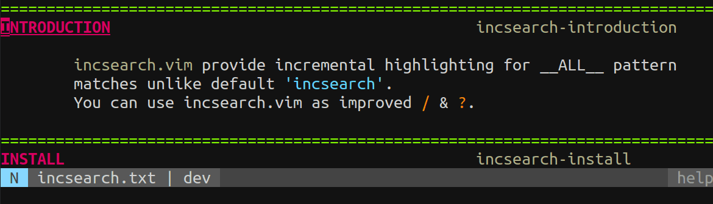
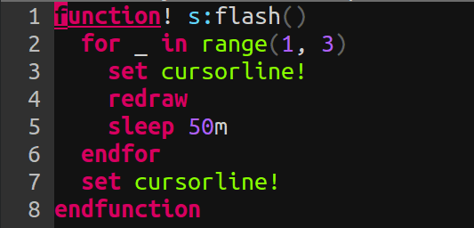

この記事は[Vim Advent Calendar 2014](http://qiita.com/advent-calendar/2014/vim)の14日目の記事です。
13日目は deris さんによる[スマートフォンでVimを操作するためにやっておいたほうがいいこと - derisの日記](http://deris.hatenablog.jp/entry/2014/12/13/173125) でした。

1. incsearch.vim つくった
-------------------------
### Vimの検索体験をリッチにする, incsearch.vim を作りました

<div class="github-card" data-github="haya14busa/incsearch.vim" data-width="500" data-height="150" data-theme="default"></div>


<br>

### あなたとincsearch.vim 今すぐインストール

```vim
NeoBundle 'haya14busa/incsearch.vim'
Plugin 'haya14busa/incsearch.vim'
Plug 'haya14busa/incsearch.vim'
map /  <Plug>(incsearch-forward)
map ?  <Plug>(incsearch-backward)
map g/ <Plug>(incsearch-stay)
```

### TL;DR
1. Vim デフォルトの検索だとインクリメンタルハイライトは1つのマッチしかみてくれない
2. incsearch.vim はマッチしたもの__すべて__をインクリメンタルにハイライトする
3. デフォルトのコマンドラインと高い__互換性__を持っているのでインストールしてデフォルトの`/`を置き換えてもスムーズかつ手軽に使える
4. 本日バージョン1.0としてリリースしました
5. ぜひ使ってみてください...!

※ ホントにToo long になった感があるので記事は長くて嫌いになってもincsearch.vimはシンプルに使えるので嫌いにならないでくださいっ...!

2. Introduction
-------------------------

Vimの検索を便利にする. incsearch.vim を バージョン 1.0 としてリリースしました!

「百聞は一見に如かず」ということで, 冒頭のgifなどを見ていただくだけで大事なことはすべて伝えつくしてしまった感があります.
「もう便利さはわかった!」 という方は記事なんてすっ飛ばして是非ブラウザバックして使ってみてください!

しかし今まで日本語でまともに解説したことがなかったこともあるので, ちょっとした便利機能やカスタマイズの仕方, 開発についてなど話していきたいと思います. もうすでに使っていたり, 聞いたりしたことあるよーという方も, 本日バージョン1.0としてリリースし, 以前から比べてインクリメンタルに改善してきたので少しは新しい情報もあるかなーと思います

3. incsearch.vim の機能を解説していくっ!
--------

### 3.1 シンプルにすべてをハイライトするっ
1. デフォルトの [:h 'incsearch'](http://vim-jp.org/vimdoc-ja/options.html#%27incsearch%27) とは違い, マッチしたパターンのすべてをハイライトする
2. 別ウィンドウのハイライトも対応できる(オプションで変更可, version 1.0 で追加されました)

一番シンプルかつメインの機能としてマッチしたパターンをすべてハイライトします.
便利さ, 自明っぽいので説明を省きます!


### 3.2 正規表現をインテラクティブに作って確認する
1. デフォルトの検索だとエンターを押して`:set hlsearch` 状態になるまで, 現在入力している正規表現がどこにマッチしているかわからない
2. incsearch.vim はもちろん正規表現に対応しており, スムーズに正規表現を作っていける
3. `<Plug>(incsearch-stay)` というマッピングを提供しており, これはカーソルが動かないので途中でウィンドウ外に飛ぶといったこともない

マップ例:

```vim
map g/ <Plug>(incsearch-stay)
```


(冒頭のgifと同じ)

これは vimrc によく書かれているプラグインマネージャが提供してるインストールコマンドから, インストールされているプラグインの部分とマッチする正規表現を作ってます(簡易版ですが). 普段の検索時にも勿論便利なのですが, 正規表現作る際の便利さは1つしかマッチを確認できないデフォルトの挙動と比べると段違いに捗ります. もしも incsearch.vim でデフォルトの検索を置き換えるまでもないかなーという人でも, 正規表現による検索の際のために`g/`など好みのマッピングに定義しておくとこういうケースでは便利に使えると思われます.


### 3.3 検索中のインクリメンタルカーソル移動とスクロールで快適ファイル内検索
1. Emacsは検索中にカーソルを前後に動かせるけどVimにはない...
    - ※ Vim には `n`/`N` があるので別になくてもよい
2. incsearch.vim はデフォルトでは `<Tab>`/`<S-Tab>`で前後のマッチに移動できる
3. Emacsや他のエディタでは見ない機能としてスクロール機能を提供しており, 画面内に目的地がないと判断すれば一気にスキップして画面外の次のマッチに飛べる(デフォルトでは`<C-j>`/`<C-k>`)


*なにが便利か?*

#### a) オペレータ待機モード時のモーションとドットリピート

ノーマルモードでは問題でもないですが, `d/{pattern}` といった オペレータ待機モード
で使う場合, 決定したあとに `n`/`N` を使うことはできません. しかし,
最初に目測でマッチを確認してからカウントをつけて `3d/{pattern}` とするのはとてもしんどい上に間違う可能性もあり, 生産的ではありません...

また1回だけの場合は ビジュアルモード を使えば上記の問題は回避できますが, これだとドットリピート が効きません.

そこで, incsearch.vim の `<Tab>`/`<S-Tab>` (`:h <Over>(incsearch-next)`) を使って
検索中にカーソルを移動させれば一目で目的地まであとどれくらいかもわかるし,
オペレータと組み合わせるモーションとしての使用も, その後のドットリピートの問題も解消できます.

#### b) `:h jumplist` の更新が1回で済む
ノーマルモードでは問題でもないといったな? あれは嘘だ!

Vimには `:h jump-motions` というモーションの種類があり, これに属するモーションを
行うとジャンプ前のカーソル位置が記憶され, `<C-o>`/`<C-i>` でそれらのカーソル位置を
行ったり来たりできる超便利機能が存在します. 検索系のモーション(`/`,`?`,`n`,`N`, etc..)
はこの jump-motions に属しており incsearch.vim でも勿論対応しているのでその機能を
バリバリ使うことができます.

ここで問題なのは `n`や`N` も jump-motions ということです. 検索後に `n`/`N`で移動したあとやっぱり検索した元の位置に戻りたいな〜という時に
`n`/`N` を押した回数分`<C-o>`を押す(またはカウントを前置する)必要があって地味に不便です.

incsearch.vim で検索中に`<Tab>`を押して移動してから検索を決定すれば勿論 `jumplist`
の更新は1回で済むので`jumplist`を汚すことなく十二分にそのジャンプ機能の便利さを享受することができます.
地味なよさがありますね.

#### c) スクロール機能で `n` 連打せずファイル内をサクっと検索
a), b) は1つ1つ前後に移動する機能の紹介でしたが, incsearch.vim は スクロール(デフォルトでは
`<C-j>`がスクロールダウン, `<C-k>`がスクロールアップ)という機能を搭載しており, これは人に
よってはライフチェンジングになりうるなかなかオススメ機能の1つです.

先ほどのgifを見てもらうとわかりやすいかと思うのですが,

*デフォルトの場合*

1. 「あーファイル内の{pattern}って部分に用があるな〜」
2. 「よーし`/{pattern}<CR>`で検索して`n`, `n`, `n`, ...」
3. 「まだ見つからない...(ファイル内に`{pattern}`がたくさんあって辿り着かない)」
5. => 不便...

*incsearch.vimのスクロール機能を使った場合*

1. 「あーファイル内の{pattern}って部分に用があるな〜」
2. 「よーし`/{pattern}`で incsearch.vim を起動しよう」
3. 「あー画面内にいっぱい`{pattern}`がある...よし`<C-j>` で次の画面へ」
4. 「`<C-j>`を数回押して目的地発見. 任意で`<Tab>`/`<S-Tab>`で前後に移動してから`<CR>`!」
5. => _幸せ便利_

勿論, そもそもファイル内にたくさん存在しないようなキーワードを使って検索したり, タグが存在するなら
ctagsなどを使用してタグジャンプしたほうが断然よいですが,
いつでもユニークなキーワードが思い浮かんだり, タグが存在するわけではないので万能ではありません.
検索だとかなり汎用性が高いので個人的にはとても多用してる機能の１つになってます.

また他にもファイルの横断検索を補助するような機能を提供しているVimの機能や
プラグインなどなどはあるとは思いますが, 以下のようなメリットがあります

1. "検索" として使える
    - `gn`や`:substitute`と連携したりなど"検索"は他のVimの機能と一緒に使うことによって,
      相乗効果でより手に馴染む快適なキーストロークでエディットすることができます.
2. 周囲のコンテキスト, 前後の行がみやすい
    - `:vimgrep` や `unite-line` といった機能はだいたい前後の行が見れなかったりして
      ユースケースによっては困ることもあります. ただし`grep`
      などは複数のファイルを扱える大きなメリットがあるので使い分けれるようになるのが一番よさそうです.

### 3.4 オート:nohlsearch
1. `:set hlsearch`って便利でもあるけどだいたいウザイ
    - `nnoremap <Esc><Esc> :<C-u>nohlsearch<CR>` と言ったマッピングで検索後に消す人が多いと思います.
2. incsearch.vim の `オート:nohlsearch` 機能を使えば検索後カーソル移動したらハイライトが消えるようになります.
3. 地味に便利



#### 設定

```vim
set hlsearch
let g:incsearch#auto_nohlsearch = 1
map n  <Plug>(incsearch-nohl-n)
map N  <Plug>(incsearch-nohl-N)
map *  <Plug>(incsearch-nohl-*)
map #  <Plug>(incsearch-nohl-#)
map g* <Plug>(incsearch-nohl-g*)
map g# <Plug>(incsearch-nohl-g#)
```

※ `<Plug>(incsearch-nohl-n)` などは単なる `<Plug>(incsearch-nohl)n` のエイリアス
なので独自の `n`や`*`の機能を提供しているわけではありません

### 3.5 他のプラグインと組み合わせて使う
(3.4のつづき)

`incsearch.vim` は `/` とそれにまつわる検索の便利機能を提供するようにシンプルにしようとデザインしてるつもりです(そこっ!検索にまつわる〜とか言ってる時点でシンプルではないとか言わない!). なので `n` や `*` を拡張したい場合に備え別の拡張プラグインと同時に扱える用に設計しています.

普通に一緒に使う分には何も考えなくとも併用できますが, incsearch.vim の オート :nohlsearch 機能 を使いたい場合はマッピングをちょっといじる必要があるので自分が使ってる例を出してみます

#### n 拡張プラグイン vim-auzu と一緒に使う
<div class="github-card" data-github="osyo-manga/vim-anzu" data-width="500" data-height="150" data-theme="default"></div>

```vim
map   n <Plug>(incsearch-nohl-n)
map   N <Plug>(incsearch-nohl-N)
nmap  n <Plug>(incsearch-nohl)<Plug>(anzu-n-with-echo)
nmap  N <Plug>(incsearch-nohl)<Plug>(anzu-N-with-echo)
```

vim-anzu は `n`/`N` を押すとファイル内の `現在位置までの数/全マッチ数` を表示してくれる拡張機能です.

#### * 拡張プラグイン vim-asterisk と一緒に使う
<div class="github-card" data-github="haya14busa/vim-asterisk" data-width="500" data-height="153" data-theme="default"></div>

```vim
map *  <Plug>(incsearch-nohl)<Plug>(asterisk-*)
map g* <Plug>(incsearch-nohl)<Plug>(asterisk-g*)
map #  <Plug>(incsearch-nohl)<Plug>(asterisk-#)
map g# <Plug>(incsearch-nohl)<Plug>(asterisk-g#)
```

または vim-asterisk の`z*`機能(カーソルが動かない`*`) をメインに使う場合

```vim
map *  <Plug>(incsearch-nohl0)<Plug>(asterisk-z*)
map g* <Plug>(incsearch-nohl0)<Plug>(asterisk-gz*)
map #  <Plug>(incsearch-nohl0)<Plug>(asterisk-z#)
map g# <Plug>(incsearch-nohl0)<Plug>(asterisk-gz#)
```

vim-asterisk は僕が最近作った `*` をカイゼンするプラグインです. 機能としては

1. カーソルを動かさない `*` 機能の提供(マッピングにzのprefixがついてる)
    - 動かさずに `*` や `g*` でカーソル位置の単語を検索レジスタ(`@/`)に入れたあとに
      `gn` などを組み合わせて編集したいというケースでは次のマッチに飛ぶ必要がないので
      カーソル動かないバージョンの `*` が欲しかった. どうせ `n`/`N` ですぐ動かせる
    - `noremap * *N` という解決法はダサいしウィンドウが一時的に動くので不便
2. ビジュアルモードで選択したテキストを検索するvisual-star 機能
    - サクッと勢いで作ったので [thinca/vim-visualstar](https://github.com/thinca/vim-visualstar)
      のマルチバイトや `keyword` の扱いの部分のコードをお借りしています. ありがとうございます
    - visual-star は `CursorMoved` イベントが2回発生してしまうという問題があり,
      incsearch.vim の オート:nohlsearch 機能と併用できなかった.
      なので visual-star機能と同時に使いたい場合はvim-asteriskのvim-asterisk機能を使うと便利
3. ignorecase だけでなく smartcase の値も一緒にみてくれる
    - デフォルトはなぜか `ignorecase` の値しかみてくれず, `smartcase` を設定していても`ignorecase`状態で検索される
    - 非直感的すぎるので vim-asterisk は `:set ignorecase`の値も`:set smartcase`をみるようになっています

### 3.6 Vim のデフォルトからちょっとカイゼン
#### a) magic オプションカイゼン
Vimには `'magic'` という正規表現のエスケープする文字を変えるオプションがありますが
`\m`, `\M` しか設定できません(`:h /magic`).
またこれは`/`だけでなくすべての正規表現の挙動を変えてしまい設定すると,
対応できていないプラグインが動かなくなったりする問題があります (`:h 'magic'`)

incsearch.vim ではこれをカイゼンして `\v`, `\V`, `\m`, `\M` の, どの magic でも設定できる. また勿論他のプラグインには一切影響しません.

*例*
```vim
let g:incsearch#magic = '\v'
```

#### b) カーソル下単語補完やCtrl-Wによる単語削除のカイゼン
Vimは`set incsearch`状態で検索中に`<C-r><C-w>`を押すとコマンドラインのカーソル前の単語とのマッチをみて,
バッファのカーソル下の単語を補完してくれる機能を持っています.
この機能自体はとてもべんりなのですが, コマンドラインが `/\vwo` の状態, カーソル下の単語が `word` の時に
`<C-r><C-w>` を押しても補完が発動せず単にカーソル下の単語が挿入され `/\vwoword`になってしまいます.

これはvery magicオプションを設定する`\v`の`v`部分と`wo`との区別がなく`vwor`
がコマンドラインのカーソル前の単語と認識されているのが原因なので, カーソル前の単語
の範囲をかしこく決めてくれる機能を提供しています(オプションでoffにすることは可能です. `:h g:incsearch#smart_backward_word`)

`<C-w>` によるカーソル前の単語の削除も同様の問題がありこれもカイゼンして,
`/\vword`状態で`<C-w>`を押すとデフォルトだと`/\`となるところを`\v`となるようにしています


見た目はとっても地味で聞いてもピンとこないかもしれないですが, 挙動が直感的になるとても気に入ってる機能のひとつです. ｼﾞｯｻｲﾍﾞﾝﾘ

### 3.6 マッピングについて
1. `:cnoremap` や `:cmap` に設定されているマッピングは自動で適用される
2. incsearch.vim が提供する機能へのマッピングや, `:cnoremap` の設定の上書き,
   incsearch.vim でのみマッピングしたいという場合は `:h IncSearchNoreMap` コマンド
   を使います

*設定例*

```vim
augroup incsearch-keymap
    autocmd!
    autocmd VimEnter * call s:incsearch_keymap()
augroup END
function! s:incsearch_keymap()
    IncSearchNoreMap <Right> <Over>(incsearch-next)
    IncSearchNoreMap <Left>  <Over>(incsearch-prev)
    IncSearchNoreMap <Down>  <Over>(incsearch-scroll-f)
    IncSearchNoreMap <Up>    <Over>(incsearch-scroll-b)
endfunction
```

### 3.7 autocmd で拡張できる

参照: `:h incsearch-autocmd`

incsearch.vim は Vim デフォルトのコマンドラインのと違い独自の autocmd イベントを発行しているので, それをつかってincsearch.vimを拡張することができます. 以下は [inside/vim-search-pulse](https://github.com/inside/vim-search-pulse) というプラグインの機能を簡単に組み込んでみた例です. 個人的には要らないけどなんかカッコイイ...!?



```vim
function! s:flash()
  for _ in range(1, 3)
    set cursorline!
    redraw
    sleep 50m
  endfor
  set cursorline!
endfunction

augroup incsearch-pulse
    autocmd!
    autocmd User IncSearchExecute call s:flash()
augroup END

noremap <silent> <Plug>(my-flash) :<C-u>call <SID>flash()<CR>
map n <Plug>(incsearch-nohl-n)<Plug>(my-flash)
map N <Plug>(incsearch-nohl-N)<Plug>(my-flash)
" デフォルトの場合
" map n n<Plug>(my-flash)
" map N N<Plug>(my-flash)
```

4. Development
--------------

開発の話とか.

### 4.1 Design

ここまでいろいろと紹介しておいてどうかという話なのですが, incsearch.vim は
*シンプル*に機能を提供し , デフォルトのコマンドラインと高い*互換性*を保ちつつ,
それでいて*拡張性*の高いものにしようというコンセプトでつくっています(実際そうなっているとは言ってない)

特に一番苦心したのはデフォルトのコマンドラインとの互換性を保つように開発するところでした.
現在はVimのデフォルトの`/`でできるほとんどのことはできますが,

ビジュアルモードでのハイライトだったり, vim-repeat といった別のプラグインに依存せず
ドットリピートを可能にしたり, 逆にそれを可能にした `<expr>` マッピングによる `textlock` という
Vimの制限を解消するために, 必要でない部分は`<expr>` マッピングを使わないようにするといった回り道を
しながら, 現在はほぼデフォルトと互換性のある状態にできたと思います.

#### `<expr>` についてちょっと解説したりする
1. `:h :map-<expr>`
2. ドットリピート対応できる
3. `:h function-search-undo` とかの制限をかいくぐれる
4. いろいろいじった上で最終的にデフォルトのマッピングを返して実行! ということができるのでデフォルトのモーションを拡張する際にとても便利
5. しかし問題点もある

`<expr>` とは expression mapping の略で, `{rhs}`(right-hand-side) を評価した値を返してくれます.

```vim
noremap <expr> g/ printf("/%s\<CR>", input('>'))
```

上記のマッピング例では, `{rhs}` の `input('>')` が評価され, そこで入力した値を`{pattern}`とすると
それが`printf()`によって最終的には `/{pattern}<CR>` になります.

何がいいのかというと, 実際に `dg/pattern` などと使った際に, `{rhs}` が評価されて `d/pattern` になります.
これはそもそも最初から `d/pattern` と打った時と同様の挙動になるので, あたかもデフォルトの`/`を使ったような挙動を簡単に実装できるのです!
これによって ドットリピート や `:function-search-undo` に対応することが可能となります.

とは行ってもイマイチわかりにくいと思うので `<expr>` を使わないマッピングを見てみましょう.

```vim
function! s:non_expr_search()
    execute 'normal!' printf("/%s\<CR>", input('>'))
endfunction
noremap z/ :<C-u>call <SID>non_expr_search()<CR>
```

単に検索という意味では動いているように見えるのですが, `function-search-undo`の制限により
ハイライトされず, また `dz/pattern` は `d:<C-u>call <SID>non_expr_search()<CR>` となるので,
ドットリピート時にも `s:non_expr_search` 関数が呼ばれてしまします. これによってその中の
`input()`がドットリピートでも呼ばれてしまい入力待ちになってしまいます.
これでは以前に入力した値をつかって検索してくれるデフォルトのドットリピートの挙動が再現出来ていません...不便...

普通のマッピングだとこういう問題があるのでそれを解消ができる `<expr>`
はデフォルトのモーションの拡張にとてもあっているのですが,
`<expr>` は`<expr>`で上述した副作用として `:normal` が使えないといった問題もあるので
これから`<expr>`を使ってプラグイン作りたいっという方は注意して使ってみてください.

incsearch.vim や先ほど紹介した vim-asterisk も`<expr>`を活用して便利にしたりしています.
他にも [rhysd/clever-f.vim](https://github.com/rhysd/clever-f.vim) や [deris/vim-shot-f](https://github.com/deris/vim-shot-f)
といった `f` を拡張するプラグインでも `<expr>` が使用されており, もともとこの`<expr>`でドットリピートに対応するという方法は
僕は clever-f で初めてみました. スゴイ.

### 4.2 vital-over, または incsearch.vim のカスタムコマンドラインインターフェースについて
<div class="github-card" data-github="osyo-manga/vital-over" data-width="400" data-height="150" data-theme="default"></div>

incsearch.vim は vital-over というカスタムコマンドラインインターフェースを提供するライブラリを使わせていただいてます.
incsearch.vim のデザインとしてVimデフォルトとの互換性を目指していると先ほど書いたのですが,
実はincsearch.vimがやっている部分は検索だけで,
コマンドラインインターフェースがVimのデフォルトと同じように使えるのはこの vital-over というライブラリのおかげです.
本当にアツイプラグインなので興味あるVim プラグイン開発者は是非使ってみてください!

モジュール性が高いのでガッツリとしたコマンドラインとしてではなく, ちょっと便利な `input()` や
`getchar()` として使えるかなーと思います. そのうち何かまた作ってみたい...!


### 4.3 テストとかLintとか
1. themis.vim でテスト書いた
2. vim-lint / vint (期待)
3. テストって便利って改めて気づいた...!
4. themis のテスト書き方自体は [vim-jp/vital.vim](https://github.com/vim-jp/vital.vim) など他のものを参考にするとよいと思う

<div class="github-card" data-github="thinca/vim-themis" data-width="400" data-height="150" data-theme="default"></div>
<div class="github-card" data-github="syngan/vim-vimlint" data-width="400" data-height="153" data-theme="default"></div>


今回incsearch.vim は(現在が開発&メンテしてるvim-easymotionでもちょっとずつやってはいましたが)割と初めてスクラッチでテストやlintをしながら
書いたものだったのですが Vim script の開発周りの環境はかなり便利です. 特に __Vim__ を使えるところが開発しやすくてよいです.

CI も travis で 最新に近い Vim と travis.org の Vim のバージョンの両方でテスト
([Test on the latest Vim by crazymaster · Pull Request #241 · vim-jp/vital.vim](https://github.com/vim-jp/vital.vim/pull/241)) したり,
[Vim プラグインを Windows 環境でテストする - 永遠に未完成](http://d.hatena.ne.jp/thinca/20140812/1407775202)
を参考に Windows 環境 でもテストがしてみたりしてなかなかよかったです. (~~Windows環境だけで違う挙動になるのヤメローッ!~~)

Lint に関しては [Kuniwak/vint](https://github.com/Kuniwak/vint) という python 製ツールも気になっているので期待ですね.

### 4.4 Vim script 楽しいっ

テストやLintツールもあるし,
[vim-jp/vital.vim](https://github.com/vim-jp/vital.vim) や
[osyo-manga/vital-over](https://github.com/osyo-manga/vital-over)
といったライブラリ, Vim から引ける膨大な`:help`, 困ったら [vim-jp – Lingr](http://lingr.com/room/vim/archives#message-20835831)
や [Issues · vim-jp/issues](https://github.com/vim-jp/issues/issues) に相談, バグ報告できる環境,
Vim を使って開発できる Vim script を書くのは楽しいです...!

<br>
........
<br>
<br>
**....ほんとうですよっ!?** (言語仕様は寛容な心でカバー)
<br>
<br>

ぜひぜひみなさんVim プラグイン開発やっていって開発効率を上げたり快適でリッチなエディタ環境を作ってみましょう...!

(※ 用法, 用量を守ってただしくVimしましょう)

5. 最後に
---------
話が逸れてる感をひしひしと感じますが, あくまで incsearch.vim を紹介・解説する記事だったはずなので話を戻しましょう.

incsearch.vim, 今でもとても便利だと思っているのですが, まだまだ開発していく余地があります. (後方互換性を壊すことはしないと思います)

autocmd の拡張例を上述しましたが, まだコマンドラインの中身をいじれるようなインターフェースは実は提供できていません.
どこまでオープンにしていけばいいのか, オープンにしたら本当に便利になるのか,
などなど僕にとっては難しくゆっくり考えながら決めて行きたいです.  意見頂けたりとかコントリビューションお待ちしています...!


Vim Advent Calendar でテンションあがってちょっと長くなってしまいました. ここまで読んでくださった方ありがとうございます.

incsearch.vim 是非1度使ってみてください. 気に入って頂けるとそれはとっても嬉しいです!


それではVim Advent Calendar 2014の14日目の記事でした.

Happy Vimming!

<script src="http://lab.lepture.com/github-cards/widget.js"></script>
