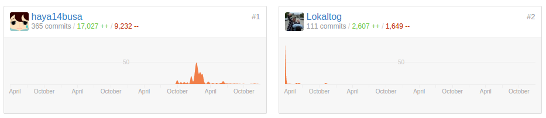
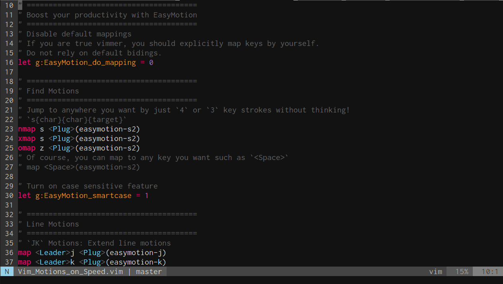
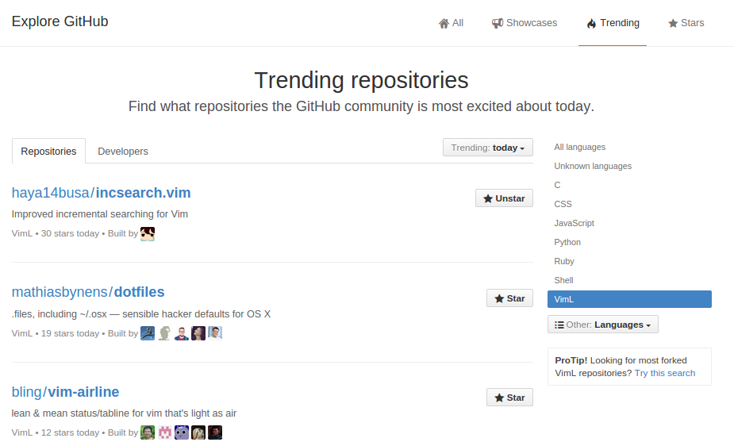
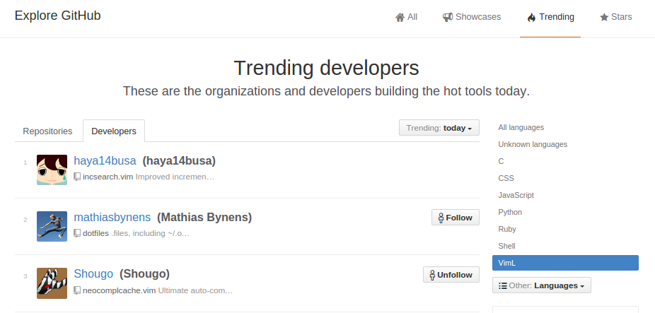

この記事について
----------------
この記事は [Vim Advent Calendar 2014](http://qiita.com/advent-calendar/2014/vim) の30日目かもしれません(または来年, Vim記事集約系のイベントやりたいという気持ちの1つです).

今年の2月に [1年間『Vim駆動学習』してきて最高に楽しかったのでオススメしたい - haya14busa](http://haya14busa.com/vim_driven_learning/) というVim歴換算で1年を振り返ったエントリーを書いたのですが, 今回は2014年を振り返ってみたら, やっぱりVim活たのしかったなぁという日記的エントリーです.

また思い返してみると僕がプログラミング始めたのは2年と少し前だったので, 2014年はプログラミング2年目の年でもありました.
この文脈でみると**「プログラミング2年目をVimに捧げるとどうなるか?」** というエントリーとも言えそうです. (※1年目からかなりの割合をVimに捧げていました)

2014年, 今年のVim活を振り返る
-----------------------------

※Vim活が9割です

### カーソル移動系人気プラグインの vim-easymotion の開発を乗っ取った!

- [Lokaltog/vim-easymotion](https://github.com/Lokaltog/vim-easymotion)
- [haya14busa/vim-easyoperator-phrase](https://github.com/haya14busa/vim-easyoperator-phrase)
- [haya14busa/vim-easyoperator-line](https://github.com/haya14busa/vim-easyoperator-line)
- ブログ記事: [Vim-EasyMotionでカーソル移動を爆速にして生産性をもっと向上させる - haya14busa](http://haya14busa.com/mastering-vim-easymotion/)
- 執筆時GitHubスター数: 1556

これは2013年の後半からforkして活動していて, 今年の2月くらいに起こった出来事なのですでに下記の記事に少し感想を書いています.

-> [1年間『Vim駆動学習』してきて最高に楽しかったのでオススメしたい - haya14busa](http://haya14busa.com/vim_driven_learning/)

記事執筆現在, GitHub のStar数 1556 で, 開発を引き継いだ時点での Star数は 1000 にちょっと届かない程度でした.
もともとほっといた場合の伸び具合がどれくらいかはわからないですが, 自分が引き継いだ時点で Star数 約1000 のリポジトリが, さらに500強増えたという事実は本当に嬉しいです.
GitHub Star 500+ めでたい.

これだけ 「たくさんのスター数がついている≒たくさんの人に使っていただけている」 プロジェクトを開発 & メンテするというのはなかなかに学ぶことがおおくてとても楽しかったです.
今後はリファクタリング含めもっと便利にしたいなぁと思っているんですが, そう思ってから半年くらい経過しております(すでに十分に便利&安定してきているのでモチベが低い).

### 最高の検索体験を提供したい! incsearch.vim つくった

- [haya14busa/incsearch.vim](https://github.com/haya14busa/incsearch.vim)
- [osyo-manga/vital-over](https://github.com/osyo-manga/vital-over)
- ブログ記事: [incsearch.vimでVimの検索体験をリッチにする - haya14busa](http://haya14busa.com/enrich-your-search-experience-with-incsearch-vim/)
  - [Vim Advent Calendar 2014](http://qiita.com/advent-calendar/2014/vim) の 14日目の記事でもあります
- 執筆時GitHubスター数: 231

今年の前半がvim-easymotionだとしたら, 後半はほとんど incsearch.vim でした.
実はこのプラグインは最初はサクッと気晴らしにつくったぜーというレベルのものだったのですが,
なんだかんだちゃんとしたものにしようという流れになり目一杯頑張りました.

また使用しているライブラリの [osyo-manga/vital-over](https://github.com/osyo-manga/vital-over)
にもコントリビューションという名のリクエスト丸投げや, 設計についてコメント, ダメダメな Pull Request
を交えながらいろいろ関わらせていただきました.
おしょーさんありがとうございます, 迷惑いっぱいかけてスイマセンッ, これからもよろしくお願いします..!

便利さの9割は vital-over のおかげなのですが, 自分が1から開発してるリポジトリーでスター数3桁を達成してこれもまた非常に嬉しいです. これもめでたい.

GitHubの VimL trending で Repositories & Developers の両方で1位も獲得できました...! 嬉しさ.

### VimConf 2014 で発表した
- [VimConf 2014](http://vimconf.vim-jp.org/2014/)
- 皆さんの発表などなど: [Reports - VimConf 2014](http://vimconf.vim-jp.org/2014/reports/)
- ブログ記事: [VimConf2014 で検索とその拡張について発表した - haya14busa](http://haya14busa.com/vimconf2014/)
- スライド: [/-improved](https://docs.google.com/presentation/d/1ie2VCSt9onXmoY3v_zxJdMjYJSbAelVR-QExdUQK-Tw/pub)
- 発表動画: [/-improved #VimConf2014 - YouTube](https://www.youtube.com/watch?v=yB1H5V8e1j4&list=PLx8bw5NQypsnuX8NJPRHvURhXqj2NUnGZ&index=12)

VimConf2014 という感極まるVimのカンファレンスが今年も開催されたのですが, そこでLT枠で発表させていただきました.
Vimの便利な検索機能と上述した incsearch.vim の紹介をしました. 発表グダったりもしましたが, よかったという反応をいただけたり, スライドを英語で書いたので英語圏の人にも見てもらって便利さを伝えられたのは良かったです. 英語というより gif をふんだんに活用したので伝わったという説もある.
([usevim](http://usevim.com/2014/11/14/vimconf/), [reddit](http://www.reddit.com/r/vim/comments/2lwrv0/vimconf_2014_reports/) )

ちなみに動画はテンパッて間違ったことも多々言ってるので鵜呑みにしないでください... この辺慣れるには場数を踏む必要がありそう

### 最高の検索体験を提供したい + α!. vim-asterisk 勢いでつくった

- [haya14busa/vim-asterisk](https://github.com/haya14busa/vim-asterisk)
- 執筆時GitHubスター数: 34

Vim の `*` ってとても便利なのですが, 自分のユースケースとしては次のマッチにジャンプして欲しくないという不満があったので, そこを解消するために作りました.
`*` からの `gn` テキストオブジェクト活用でスムーズに編集できるようになってとても気に入っています.

結構小さいプラグインではあるのですが, 今まで得たVim scriptの知識や経験をたくさん使っていたり, ビジュアルモードにおける `*` 機能は [thinca/vim-visualstar](https://github.com/thinca/vim-visualstar) の部分をお借りしたり, マルチバイトの扱いを[プルリク](https://github.com/haya14busa/vim-asterisk/pulls?q=is%3Apr+is%3Aclosed)貰って直したりとなかなかよさ気なものになりました.

実は似たような機能を提供してるプラグインはいくつかあるのですが, どれも不満がまだありました(Vimの検索機能周りの拡張は結構落とし穴が多い).
incsearch.vim の経験などが活きて落とし穴はうまく回避できました. 気になった方は是非使ってみてください.

### vimrc 読書会にいっぱい参加 & 管理のデータ化・自動化 & 統計ページ をつくった
- [vimrc読書会](http://vim-jp.org/reading-vimrc/)
- [vimrc読書会 Stat](http://vim-jp.org/reading-vimrc/stat/#/)
- ブログ記事: [vimrc読書会Stat作った - haya14busa](http://haya14busa.com/reading-vimrc-stat/)
- [たくさん参加してる様子](http://vim-jp.org/reading-vimrc/stat/#/u/haya14busa)

確か管理者権限貰ったのは恐らく今年(すこしあやしい...厳密には去年だったかも...)で, 参加するだけでなくちょっとずつ運営面でも関わらせていただきました.
Jekyll を覚えて 読書会のデータを yaml でデータ化したり,
そのデータを使って Angularとd3.jsで 読書会の統計ページをつくったり,
データ化によって扱いやすくなったので python や ruby で簡単なスクリプトを作成して更新作業を自動化したりしました.
読書会は毎週やるので更新が一瞬でできるようになって非常に便利になりました. 統計ページのJS, よくない部分多々あるのでそのうち書き直したい.

**毎週土曜日23:00からやっているので皆さん参加しましょう!** -> [http://lingr.com/signup?letmein=vim](http://lingr.com/signup?letmein=vim)

### Vim プラグイン読書会やってた
- [Vimプラグイン読書会](http://haya14busa.github.io/reading-vimplugin/)

こちらも1ヶ月周期でやっていました. Vim プラグイン開発, 興味ある. という方にオススメです! 一緒に読みましょう.
またvimrc読書会とVim プラグイン読書会での経験が, Vim以外の普段の開発のレビューにも活かされたような気も...しま...す(自信なし).

執筆時現在次の日付が更新されてないという少々のグダりを見せていますが, 落ち着いたら必ず更新します!

### Osaka.vim やで
- [Osaka.vim - connpass](http://osaka-vim.connpass.com/)
- ブログ記事: [Osaka.vim #1 に行ってきた - haya14busa](http://localhost:4000/osaka-vim-01/)

**connpass上では運営になっていますが一切の運営をしていません...!**

関西のVim勉強会, 近年ではほとんどなかったので便利. 関西の皆さん参加しましょう.

### Vimで緊急地震速報が見れるの便利では...? eew.vim つくった
- [haya14busa/eew.vim](https://github.com/haya14busa/eew.vim)
- Emacs移植: [eew.vimを移植しました - Life is very short](http://d.hatena.ne.jp/syohex/20140829/1409291511)
- Sublime移植: [tgfjt/Sublime-eew](https://github.com/tgfjt/Sublime-eew)

<blockquote class="twitter-tweet" lang="en">
総務省の某審議会のエライ人が「家でテレビで録画を見ていた際、緊急地震速報が出なかった。なんとかならないのか」との意見を述べ、プチ衝撃が走っているらしい。ｗｗｗ 確かに、テレビ見てることには変わりないけれど。
&mdash; 閑居 (@doatease2313) <a href="https://twitter.com/doatease2313/status/504522127622418434">August 27, 2014</a></blockquote>
<blockquote class="twitter-tweet" data-cards="hidden" lang="en">
とりあえずでつくった <a href="https://t.co/hQQuAnnF9M">https://t.co/hQQuAnnF9M</a> RT <a href="https://twitter.com/haya14busa">@haya14busa</a> Vimに緊急地震速報流すの便利なのでは！？！？！？
&mdash; はやぶさ (@haya14busa) <a href="https://twitter.com/haya14busa/status/505004191199162368">August 28, 2014</a></blockquote>

EmacsやSublimeに移植されたりとちょっとだけ話題になった(すこし).

### その他ちっちゃい Vim plugin 達
- [haya14busa/unite-ghq](https://github.com/haya14busa/unite-ghq)
  - uniteでghqできるの便利では...?と思ってつくって公開したら, そのわずか数時間前に sorah さんが [sorah/unite-ghq](https://github.com/sorah/unite-ghq) を公開しており,
    しかもこちらのほうが基本的によくできていて「ｱｱｱｯ...」とリアルで声がでた少し苦い思い出のあるプラグイン. 自分のバージョン使ってるの自分だけだとおもう. でも便利.
    既存プラグインの検索は直前まで入念にやりましょうという教訓を得ました. (数日前にやった時点ではなかったので大丈夫だと思ってた)
- [haya14busa/unite-reading-vimrc](https://github.com/haya14busa/unite-reading-vimrc)
  - vimrc読書会のログやvimrcのリンクをuniteで絞り込んで開ける. たまに vimrc読書会 の管理とか過去の記録を見るときに便利.
- [haya14busa/endtagcomment.vim](https://github.com/haya14busa/endtagcomment.vim)
  - よくvimrcで見かけるhtmlタグにコメントをつけるスクリプトをforkしてプラグイン化しただけ. もともと便利
- [haya14busa/unite-action-vimfiler_lcd](https://github.com/haya14busa/unite-action-vimfiler_lcd)
  - vimfilerで`lcd`してから開くというuniteアクションが欲しかった. 結局つかってないのであまり便利じゃない.
- [haya14busa/vim-textobj-number](https://github.com/haya14busa/vim-textobj-number)
  - 数字のテキストオブジェクト. たまに便利. テキストオブジェクト学ぶかぁーという意図も含まれてた気がするけど結局それ以降テキストオブジェクト系プラグインは作成してない. なにかアイデア湧いたら作りたい.

Vim活以外の進捗(残りの1割)
--------------------------
- プログラミングのバイトを4月からはじめました(たぶんVim活アピール補正はかかりました. ある意味 Vim script もペイする言語...?).
- それに伴って Scala をやりはじめたんですが視野が広がってとてもよかったし, もっと学んでいきたいです.
- JavaScript もそこそこ書いて, Angular.js に触れたりなどしました. underscore.js も便利.
- しかし Scala その他 Vim 以外のOSS活動の進捗ﾀﾞﾒです
- heroku にPythonで小さいウェッブアプリをつくったのですが, 乗っかってるサービスが終了したので一緒にお亡くなりになってつらい.

### 勉強会にちょっとずつ参加するようになった
- [Enjoy.scala ! 日本最大級の Scala のカンファレンス - ScalaMatsuri](http://scalamatsuri.org/)
- [関西関数型道場 - 第02回 - 関西関数型道場 | Doorkeeper](http://kansaifp.doorkeeper.jp/events/17206)
- [fpscala-osaka - connpass](http://fpscala-osaka.connpass.com/)

Vim 以外の勉強会にも今年はちょっとずつ参加するようになりました(Vimも基本的には今年からですが). しかしこれは進捗でゎなぃな...

その他
------

### GitHub current streak 365 日達成した
<blockquote class="twitter-tweet" lang="en">
気づいたらGitHubｺﾝﾄﾘﾋﾞｭｯｼｮﾝ Current streak 365日を達成していたっ...!!! <a href="http://t.co/XMED6OLFUp">pic.twitter.com/XMED6OLFUp</a>
&mdash; はやぶさ (@haya14busa) <a href="https://twitter.com/haya14busa/status/544899856037208065">December 16, 2014</a></blockquote>

dotfile 1行変更といったものがたくさんあるので全く大したことはしてないのですが, 日によってはそのついでにちゃんとプログラミングするぞっ! というきっかけになるので自分には合ってる継続的進捗管理術でした. 1年継続めでたい.

### 2014年 GitHub の Pull Requests / Issues 一覧

*追記:*

- [2014年に出した Pull Requests 一覧](https://github.com/pulls?q=is%3Apr+author%3Ahaya14busa+created%3A%222014-01-01+..+2015-01-01%22+)
- [2014年に開いた Issues 一覧](https://github.com/issues?q=is%3Aissue+author%3Ahaya14busa+created%3A%222014-01-01+..+2015-01-01%22+)

PullRequest 8 opens / 83 closed, Issues 53 open / 95 closed ※99% Vimである

### Podcast 聴くようになった

聴いてるPodcastは

- [Rebuild](http://rebuild.fm/)
- [mozaic.fm](http://mozaic.fm/)
- [バイリンガルニュース (Bilingual News)](https://itunes.apple.com/jp/podcast/bairingarunyusu-bilingual/id653415937?mt=2)
- [The Changelog Podcast](http://thechangelog.com/podcast/)
- [The Binpress Podcast](https://itunes.apple.com/us/podcast/the-binpress-podcast/id897178291?mt=2)
- その他適当に気になったもの.

という感じです. 例に漏れず(?), Rebuild.fm から聴き始めてめっちゃおもしろいっ! となり, そこから バイリンガルニュース や The Changelog を聴くようになりました. 
最近はずっと気になってはいたけど聞いていなかった mozaic.fm を聴くようになって, こちらも Rebuild とは別のベクトルのよさがあって全部聴きました. 技術系(?)英語 podcast の binpress podcast というポッドキャストは, 全部無料でスクリプトがついているという*エイゴ・ゼンゼン・キキトレナイ勢*としては歓喜のサービスがついていてお気に入りです. おもしろさは回によって違う感じですが, 英語もついでに学ぶかーという方にはオススメです.

リスニング能力高めてもっと英語のポッドキャストを楽しめるようになりたい...

### 英語の記事をコンスタントに読む & 検索するようになった
- [reddit.com/r/vim](http://www.reddit.com/r/vim/)
- [Hacker News](https://news.ycombinator.com/)
- [Medium](https://medium.com/)
- [Prismatic](http://getprismatic.com/home)

1年目も別に避けたりはしてなかったのですが, 最近は能動的に英語の情報に触れようとする確率が高くなったかなと思います.
検索や話題になっている記事を除けば, 見ているのはだいたい上記のリンクです.
ただ単に読んでるだけではなかなか得るものも少ないので, 自分から英語で発信する能力をつけたいなーというのが最近の悩みです.
現状 GitHub の issue のやりとりやプラグインのドキュメントは基本英語を使ってるのですが, もっともっと使っていかないとなかなか身につかないですねー.

来年の抱負とか
--------------
- Vim もっと頑張る.
- Vim のソースコード側も C言語ちょっとぐらい読み書きできるようになって簡単なバグくらいなら報告だけでなく修正案まで出せるようにしたい.
- Vim 以外も頑張る. なにか小さなウェッブサービスとか適当につくったりしたい.
- Scala力をより深めるのに加えて C, Go, Haskell あたりの言語を触って学んでいきたいという思いがある.
- データベース周りとか, 今触ってるレイヤーと別の部分も触っていきたい. 最低限基礎力が欲しい.
- 英語力をつけていきたい. Vim について英語で適当に英語用Twitterアカウントつくってつぶやくとかなら継続してできるのでは...?という考えがある.
  欲を言えば Lingr の Vim 部屋のノリで英語でチャットとかできれば一番いいんじゃないかという思いがある. IRC に #vim チャンネルあるらしいけど, IRCよくわからない...ログ読みたい...
- 人生は厳しいので人生についてちゃんと考える必要がある. 人生キビシイ.

「プログラミング2年目をVimに捧げるとどうなるか?」
-------------------------------------------------
少々Vim以外の進捗が少なすぎる気がするのは反省ですが, Vim活によってVimというコンテキストに留まらず, たくさんの貴重な経験ができました.
git や GitHub, テスト, CI, オブジェクト指向やらクロージャ, 変数や関数の名前の付け方, 英語での技術系コミュニケーションなどなど, たくさんのことを Vim駆動で理解したり, 理解を深めた1年間だったと思います.

Vim駆動学習, よさがあるのでオススメです. ※ただし用法用量を守って正しく Vim 活しないと Vim 以外の進捗が遅れます. 反省...

また Vim だといろいろな言語を使ってる人がいて, しかも雲の上のような存在の人もたくさんいたり, オンラインでもオフラインの勉強会でも活動が活発なのでVim以外にもいろんなことが知れるし, プログラミング初学者でも最初から Vim をガンガン使ってプログラミングしていくのはおもしろいかなぁと思います.

振り返ってみるとたくさんのVimmerにお世話になったなぁと思います. ※もちろんVimmerでないひとにもお世話になりました.

みなさん今年はお世話になりました. 来年の2015年もぜひ仲良くしてください. よろしくお願いします.

以上, [@haya14busa](https://twitter.com/haya14busa) の 2年目の~~プログラミング~~ Vim活記録でした.

