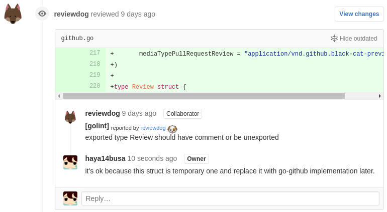
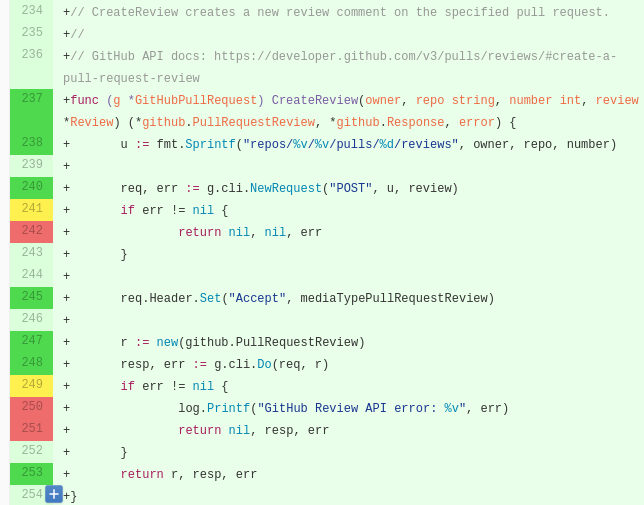

この記事は [Go (その3) Advent Calendar 2016](http://qiita.com/advent-calendar/2016/go3) の24日目の記事です(代打)．
メリークリスマス!

本記事では Go 言語プロジェクトの CI で回すと便利な各種lintの紹介やカバレッジ計測の方法などなどについて紹介します．

## Go 言語おすすめ linter

Go の lint 一覧といえば [gometalinter](https://github.com/alecthomas/gometalinter) じゃん?
みたいな話もあると思うのですが，CIで回すには個別に linter を明示的に回すほうが良いかと思います．
ということで 僕が普段使ってるオススメ linter の紹介です．

### go vet
- [vet - The Go Programming Language](https://golang.org/cmd/vet/)
- おすすめ度: ★★★★★

> Vet examines Go source code and reports suspicious constructs, such as Printf
> calls whose arguments do not align with the format string. Vet uses
> heuristics that do not guarantee all reports are genuine problems, but it can
> find errors not caught by the compilers.

Go 言語標準でついているlintツールで，コンパイラが検出しないエラーを検出できます．
false positive な結果も無いようにデザインされているのでエラーがリポートされた場合は安心してCIをfailにできます．
go vet に検出されたエラーはほぼ100%直したほうがよいでしょう．


### golint
- [golang/lint: This is a linter for Go source code.](https://github.com/golang/lint)
- おすすめ度: ★★★★☆

> Golint differs from gofmt. Gofmt reformats Go source code, whereas golint prints out style mistakes.
> Golint differs from govet. Govet is concerned with correctness, whereas golint is concerned with coding style.

gofmtがコードのリフォーマットを，govetがコードの正確性をチェックするのに対して，golint
は Go のソースコードの **"コーディングスタイル"**
の問題を報告します．これはエラーというよりも "suggestion" に近く，
基本的に従っていたほうがGoの慣習に沿った確実によいコードになるのですが，
まれに，いやここの関数はコメント書かなくても絶対いいよね...とかいうケースもあり
若干消耗することもあるので星4です．

なお，結局はコーディングスタイルの問題をリポートするという思想からデフォルトでは問題があっても
exit code は 0 になるので，落としたい場合は `-set_exit_status` flag を付けましょう．

### errcheck
- [kisielk/errcheck: errcheck checks that you checked errors.](https://github.com/kisielk/errcheck)
- おすすめ度: ★★★☆☆

errcheck は関数のエラーの返り値をハンドリングチェックしているかどうかを静的に解析してくれるツールです．
エラーを捨てた状態の場合思わぬ動作(nilになってたりだとか)するので，これをチェックしてくれるのは大変嬉しいです．

ただし，少し実際直さなくてもいいという意味でのfalse positive が多くCIで動かすには工夫が必要で星3です．エラーをチェックしてくれるという便利度は満点．
なお，最近は標準ライブラリで必ずエラーがnilとして返ってくるような関数についてはリポートしないという
false positive を減らす工夫もされているようです．

### staticcheck
- [dominikh/go-staticcheck: Staticcheck is go vet on steroids, applying a ton of static analysis checks you might be used to from tools like ReSharper for C#](https://github.com/dominikh/go-staticcheck)
- おすすめ度: ★★★★★

staticcheck は一言で言うとサードパーティーの `go vet`です．go vet でチェックされていないようなことを静的に解析してくれます．
(例えば正規表現がvalidかチェックしてくれるかなどなど...たくさん項目があるのでREADMEを見てみてください．)

作者の [dominikh さん](https://github.com/dominikh) は Go
言語の開発にも関わっていて，dominikh さん製Go lint ツールは個人的には
信頼できる印象です．github/go の issue でも  go vet のissueなどに， staticcheck
は実際こういうのチェックしてるけどと言った感じで参照されてたりするのを見かけます．

そして次の2つのツールも dominikh さん製です．

### gosimple
- [dominikh/go-simple: Gosimple is a linter for Go source code that specialises on simplifying code](https://github.com/dominikh/go-simple)
- おすすめ度: ★★★★★

gosimple は一言で言うとdominikh さん製のサードパーティー `gofmt -s` です．もっとコードをシンプルに出来るところを報告してくれます．
(ただし執筆時現在，自動で修正してくれるオプションとかはない)

例えば `if err != nil { return err }; return nil` といった構造のコードがあれば
`return err` で十分だよ? と報告してくれます．

報告に false positive もない印象で，あーそんなメソッドあったのか〜ということに気付いたりできてオススメです．

### go-unused
- [dominikh/go-unused: Check Go programs for unused identifiers](https://github.com/dominikh/go-unused)
- おすすめ度: ★★★★★

使ってない identifier をチェックしてくれます．
Go のコンパイラ自体が使ってない変数があるとコンパイル通らないという話もありますが，
unused は グローバル変数の var や const, struct の field，export されていない関数などで
使われていないものを報告してくれます．

報告してくれないのは使われてない関数の引数くらいでしょうか? これはインターフェースを満たすための関数など，
引数もらうけど使わないんやというケースなどを考えて報告されていないのではないかという気がします．[要出典]

また個人的には使えてないので強くオススメできませんが，パッケージのリストを渡して
exported なもので，渡したパッケージ内で使われていないものをチェック出来る機能もあります．
https://github.com/dominikh/go-unused#whole-program-analysis
"internal" packages などを使っていたりする場合は便利かもしれないですね．

unused は個人的には大変便利に使っていて，ごくまれにデバック用のexportしてない関数を報告されて，
あー...ってなる以外に false positive な結果もなく便利に使っています．

この前 interface を満たすためのダミーの関数をいろんな struct に定義してたんですが，
その際，追加すべきでない struct にも追加してしまい，それを unused が[報告](https://github.com/haya14busa/go-vimlparser/pull/23#pullrequestreview-11276693)
してくれたことがありました．インターフェースを満たすかどうかといった観点での"used"もちゃんと見てくれていて大変良い子だな〜と思い感動しました．
オススメです．

### gofmt -s
- [gofmt - The Go Programming Language](https://golang.org/cmd/gofmt/)
- おすすめ度: ★★★★☆

linter ではない若干番外編その1．

`gofmt -s` の結果 diff があるかどうか，つまりもっとシンプルにかけた部分がないかということをチェックできます．

コマンド: `(! gofmt -s -d . | grep '^')`

括弧は travis などのyamlでvalidなものにするために使っています．
gofmt も exit code が 1 になったりすることはないので個人的には `grep '^'`
の結果を否定することによって，diffを表示しつつ，diffがあればfailにするという手法を使っています．
(`xargs -r` とかはMacでは`-r`がないとかがある...)

基本的にGo言語開発時はみんな gofmt かけていると思いますが，`-s` は付けていなかったり，
`goimport` で `gofmt` を代用していた場合に `-s` オプションがなくてかけてなかったりするので
CI で実行するとちょっと便利です．

ちょっと便利なんですが，`-s` つけるとめっちゃシンプルになって絶対いいよね...! というよりは，
あー手元で実行してなくて，CIサーバでdiffでちゃったよ...直すか...とちょ〜っとだけ消耗することが
あるという意味で個人的にはオススメ度星4です．(goimport `-s`フラグ足してくれ〜)

### go test -race
- おすすめ度: ★★★★★

linter ではない若干番外編その2．
`go test` に `-race` を付けるとrace condition があるかチェックしてくれます．
特に goroutine とか使ってるコードであれば，CIでのテスト実行時にはぜひ付けておくべきでしょう．
僕も何度も`-race`に怒られてコード直したり，ああここlockいるなと気付かされております．

### その他
あんまり僕がまだ使えてなくて，ちゃんとオススメできないけど便利な静的チェックツールはいくつかあります．

#### interfacer
- https://github.com/mvdan/interfacer
- 引数の型とかインターフェースでいいじゃん?というところを指摘してくれる. e.g. `*os.File` -> `io.Reader`
- 個人的にはインターフェースにするといいところは最初からインターフェース使ってたりするしそこまでの恩恵は感じない

#### gosum
- https://github.com/haya14busa/gosum
- 急に拙作ツールの宣伝(?)
- Go のインターフェースで直和型っぽいことを表現したときの，type switch に抜け漏れがないかを静的にチェックするツールです．
- Scala でいう sealed trait のパターンマッチでコンパイラが抜け漏れがあると warning だしてくれるというやつのGoバージョン
- 詳しくはこの記事に書きました ->  [Sum/Union/Variant Type in Go and Static Check Tool of switch-case handling – Medium](https://medium.com/@haya14busa/sum-union-variant-type-in-go-and-static-check-tool-of-switch-case-handling-3bfc61618b1e#.lh90e9kx1)
- 書いてみて，使ってみて実際便利だと思ってるんですが，まだちゃんとCIで回したりはしてないので，その他枠で雑に紹介です．

ところで linter 書くときって，AST ベースで解析するツールが僕の観測範囲では多いと思うですが，
Goは必要であれば [go/types](https://golang.org/pkg/go/types/) パッケージを使って型情報まで使って
解析できるので大変便利ですね...! 標準ライブラリでカバーされてるところも +1

**"go/ast ではしゃいでるのはもう古い! 時代は go/types !"** みたいな煽りタイトルの解説記事を最近は待ち望んでます．
go/types 関連は標準ライブラリの中でもかなり大きいものなのでなかなか僕もまだ全貌を理解できてないです．

#### その他のその他
[gometalinter](https://github.com/alecthomas/gometalinter) とか [Go Report Card](https://goreportcard.com/report/github.com/haya14busa/reviewdog) で紹介されているツール．

https://github.com/fzipp/gocyclo
とかイマイチ恩恵を受けたことがないんですが，gometalinter とか [Go Report Card](https://goreportcard.com/report/github.com/haya14busa/reviewdog)
で使われているツールは参考になるかもしれません．

## reviewdog: linter の false positive と闘う
特に golint や errcheck など，上記でオススメしたlinterの中には，false positive
なリポートが結構あって，めっちゃ便利でチェックしたいんだけど CI で fail
にしづらい... というものがいくつかあります．

そこで拙作ツール [reviewdog](https://github.com/haya14busa/reviewdog) の紹介です．(宣伝)

もちろん Go 製です!

[](https://github.com/haya14busa/reviewdog/pull/63#pullrequestreview-13287340)

(画像は実際のPull Requestのコメントへのリンクになってます)

reviewdog は Go 言語の linter に限らず，任意のコマンドの結果を'errorformat'
という形式を使うことでパースして，*diff* で新たに追加された部分にたいする問題だけを
表示したり，GitHub にコメントすることが出来るツールです． 詳しくは -> [reviewdog を飼ってコードレビューや開発を改善しませんか - haya14busa](http://haya14busa.com/reviewdog/)

結果をdiffでフィルターすれば，それらの問題についてのみPull
Requestのレビュー時やコミット時にチェックすることが出来るので，
もし false positive な結果な場合は単に無視すれば次回以降に同じ問題は報告されません．

もちろん，例えば先に紹介した unused などは全然diffと関係ない部分で新たに問題がおきたりすることもあり，
結果を diff でフィルターするというのはfalse positiveと闘う銀の弾丸ではないのですが，
多くの場合これで十分機能を果たすでしょう．
(一応 diff 外の問題もうまくまとめて報告する仕組みも足したいな〜という気持ちはあります)

Go 製ツールである reviewdog は自分自身のコードでドックフーディングしていて，この記事で紹介した
いろんなGo 用 linter を実行していて，上記の画像のように実際に便利に使っています．
参考: [reviewdog/reviewdog.yml](https://github.com/haya14busa/reviewdog/blob/08050fc886b39f7caa4b0f39bcb2188043030214/reviewdog.yml)
(最近はyamlでも管理できるようにしていて，より簡単にローカルで実行したり，git hook で実行しやすくしたりしたいなどと改善しています)

## Goのテストカバレッジをレビューでも活用する

Go は標準で `go test -coverprofile=coverage.out .` などと実行するとテストカバレッジを取得することができます．
ただ実は CI などでカバレッジを取得する際は注意点があり，複数のパッケージをまとめてカバレッジを計測することはできません．
つまり例えば `go test -coverprofile=coverage.out ./...` とはできません．これは
`go test` 内部ではパッケージごとにテスト実行用バイナリを作成してそれぞれ実行してるという設計になっていることに起因します．
[issue](https://github.com/golang/go/issues/6909#issuecomment-233493644) は上がってますが標準では対応するのはなかなか骨が折れそうです．
(ちょっと修正してコントリビューションしてみようかと格闘しましたが構造的に地味に大変そうでした...)

そこで現状で，複数パッケージのテストカバレッジに対応するために色んな所で Makefile やGoのツールを使うといった解決方法が紹介されています．
しかし!紹介されていて，確かにある程度はどれも動くのですが，実は多くのスクリプトはちょっと片手落ちなものになっています．
例えば go test の `-coverpkg` 引数を使わないと依存先のコードカバレッジが取得できてなかったり，
結果の coverage.out に重複行が生まれるケースがあったりします．

### 解決策
mattn さんの [mattn/goveralls](https://github.com/mattn/goveralls)
では上記の問題に対応したマルチパッケージ対応テストカバレッジ機能が備わっています．というか僕がPull Request しました．
[Coveralls](https://coveralls.io/) に投稿する場合は goveralls を使うと良いと思います.  (`goveralls -service=travis-ci` でよしなにやってくれる)

### ローカルでは?
goveralls にコントリビューションしたあと，あれ...これローカルでもやりたいじゃん...ということに気付き，
既存のMakefileソリューションや似たツールはいくつかあるにはあったんですが，上記の問題などの対応とか
いろいろ面倒だったのでマルチパッケージカバレッジ作成用go test のラッパーツールを作りました．

[haya14busa/goverage: go test -coverprofile for multiple packages](https://github.com/haya14busa/goverage)

```
$ goverage -coverprofile=coverage.out ./...
```

とかするといい感じに coverage.out が生成されます．便利．

### codecov に投稿してレビューでも活用する - "おい、coverall もいいけど codecov 使えよ"
サブタイは [b4b4r07](https://twitter.com/b4b4r07) さんリスペクトです． ref: [おい、peco もいいけど fzf 使えよ - Qiita](http://qiita.com/b4b4r07/items/9e1bbffb1be70b6ce033)

[Codecov](https://codecov.io/) という [Coveralls](https://coveralls.io/) と似たサービスがあるのはご存知でしょうか?
僕は以前からたまに見かけたことはあったのですが，最近はじめて使ってみて，断然 coverall よりいいじゃん...!!! と感じました．

全体的に洗練されてる...というよさもあるんですが，一番いいところは Pull Request の diff に対するカバレッジを表示できて，
ブラウザの拡張をインストールすれば GitHub の Pull Request 画面上でカバーされた行をオーバーレイで確認できるところが大変気に入りました．

[](https://github.com/haya14busa/reviewdog/pull/63#pullrequestreview-13287340)

もちろん Codecov 上のページでも見れます: [Compare ⋅ haya14busa/reviewdog](https://codecov.io/gh/haya14busa/reviewdog/pull/63/compare)

Go 言語リポジトリのカバレッジを travis で計測して codecov へ投稿する例:

```
# .travis.yml
install:
  - go get github.com/haya14busa/goverage

script:
  - goverage -coverprofile=coverage.txt ./...

after_success:
  - goveralls -service=travis-ci -coverprofile=coverage.txt
  - bash <(curl -s https://codecov.io/bash)
```

[codecov 公式のGo言語用リポジトリの例](https://github.com/codecov/example-go#caveat-multiple-files) では Makefile を使ってますが，
完全に上記のマルチパッケージサポートの問題を踏んでるので `goverage` を使うと良いと思います．

テストカバレッジは別に100%を目指さなくてもよいと思っていて，全体のカバレッジが何％以下とか何％下がったらステータスをfail
にするといった機能がcoverallやcodecov にはありますが，この辺を有効にすると結構消耗するかと思います．

ただ，カバレッジを参考にすることは有用だし，ユニットテストが基本的に書くべきで，
Pull Request などではカバーすべきところをしっかりカバーしたテストを足したいし，
レビュー時にもそのあたりが可視化されると大変便利です．

僕はたまに Go のレビューするときは手元でテストまわしてcoverageみて，ここテストそもそも無いから足して欲しいだとか，
この行はカバーされてないけど，カバーすべき部分なのでテストケース足して欲しいとか言ったりするんですが，
codecov を使うとこのフローがやりやすいし，レビュイーもPull Request を出した時点で自分で気付いて
テスト足したりできると思います．

実は codecov 使い始めたのは最近で，僕自身がチーム開発として使った経験はまだないのですが，
coverall よりも codecov 使うとこの辺いい感じに可視化されて人間が指摘しなくてもよくなったり，
レビュワーとして指摘しやすくなったりすると思います．

せっかく Go という言語は標準でテストが書きやすく，カバレッジ計測もしやすいので，ぜひ皆さんもカバレッジを計測して，codecov 使ってみてはいかがでしょうか?

### まとめ

Go のCIでまわすと便利なlintツールを紹介したり，テストカバレッジの取得方や codecov のオススメなどをしました．
Go は `go/ast`, `go/types` など `go/` 下の標準パッケージを使ってコードをパースしてASTを取得したり，型情報を取得したりなど
するライブラリが用意されているので，必要に応じて自前でチェックツールを作ったりもしやすく面白いです．

この記事で紹介したものは，一般的に多く使われているみなさんが知っているようなものから，あまり知られてないものまであるかと思いますが，
すべて少なくとも僕が使っていて便利だなぁ〜，と思ったものを紹介してみました．
他に便利なオススメツールなどがあれば教えてください！

個人OSSプロジェクトではレビュワー最初はいない問題などがあり，最近はPull Requestを開いてlint チェックさせたり，カバレッジみたり，
改めてブラウザ画面上でセルフレビューするなどしていて，まぁちょっと面倒もあるけど良い感じです．
あとは設計レビューとかもしてくれるGoのツールがあればカンペキですね〜〜〜！！！１

もちろんチーム開発でのレビューでも，消耗しがちな非人間的な指摘は機械にやってもらって，
もっと大事な観点をレビューするために，この記事で各種紹介した手法は役に立つかなと思います．

来年も Go 書いていくぞ!
