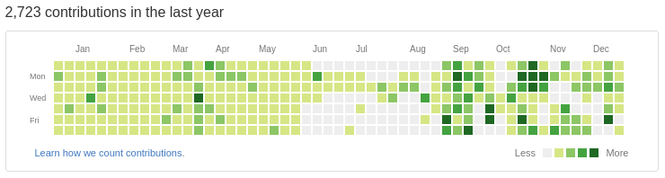
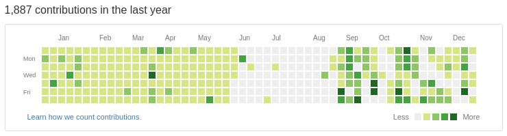

この記事では2016年 [@haya14busa](https://twitter.com/haya14busa) がやってきた活動，特にVimとかGo 活動をざっくり振り返ります．
個人的な備忘録です．あとポエム．

### 過去の振り返り記事
- [1年間『Vim駆動学習』してきて最高に楽しかったのでオススメしたい - haya14busa](http://haya14busa.com/vim_driven_learning/)
- [2014年の振り返り. またはプログラミング2年目をVimに捧げるとこうなるという話 - haya14busa](http://haya14busa.com/haya14busa-s-happy-vimming-year-2014/)
- [はてな，Googleインターン行ってイカやりすぎたイカVimmerの2015年の振り返り - haya14busa](http://haya14busa.com/look-back-2015/)

今年はざっくりプログラミング & Vimmer 歴 4年目でした．
そろそろプログラミングの基礎的なところわかってなくても，まだはじめてそんな経ってなくてまだ勉強できてないんです〜，また今度やっておきますっ!
みたいな言い訳が完全に通用しない年になってきた気がします (そもそも実際に言ったことは無い)．
まだまだ学んでおきたい分野はたくさんあって，特にもうちょっとレイヤーが下の要素もやっていって理解しておきたさがありますね...

## "Go" に恋した 2016年
AlphaGo, Pokemon GO, Amazon Go... "Go" は2016年の1つのキーワードだったように思いますが，個人的には Go 言語の "Go" に恋した1年でした．


<small>credit: [Gopher by tenntenn CC BY 3.0](https://github.com/tenntenn/gopher-stickers)</small>

### Go との出会い
Go 言語との出会いは去年インターンでGoをはじめて使ったときでした．

その時一目惚れ... をしたわけではありません．

シンプルでとにかくプロジェクトで動くものは作れる感じだったので，なんとなくGoよさそうかなぁとは感じつつも，
ちょっと気になっている子(Scala) との大きな違いに戸惑ってたりしてました．
"Functional Programming"? なにそれおいしいの? とでも聞こえてきそうな Go の雰囲気に，
僕は一歩足を引いて評価を保留してました．
ただ，さも vim で書くために生まれてきた言語では...? というほどの `gofmt`
といった周辺のツールの充実っぷりはこの頃から大好きで，言語というよりは周囲の
エコシステムがよさ...という印象でした．

また，Go と出会ったころと時を同じくして，僕はスプラトゥーンと出会ってました．
お家に帰って Go やってる場合ではなく，一日中イカする毎日．
イカの存在によって Go とはどこかビジネスライクな付き合いにとどまってました．イカはっょぃ．

### Go との別れ

それから程なくして，インターンが終了しました．
Go をいちから学ぶところからはじめたにも関わらず，
終了時にある程度のものが出来たことを Go にも感謝しつつ，
一旦 Go との付き合いもお別れになりました．

結局，まぁなんかよさそうな言語だ程度の(ふんわり)印象でここで一旦お別れしたわけですが，
後々，このときのいい環境で Go を書いてレビューしてもらったり，
教えてもらったことはとても役に立ちました．
ありがたい．

### Go との再会

2016年の春，忙しかった時期も一段落し，スプラトゥーンとの距離をうまく保てるようになった僕は
ちょっとした小さいツールを Go で書くことにしました．

理由としては，コマンドラインツールとか Go で書くのは便利そうだったことや，
来年以降もGo書くことになりそうかなぁという打算的な思考，
また同じ頃にはじめたアルバイト先のいくつかのサブシステムは Go で書かれていることもあり，
Go 書けるとそのへんも触れておもしろそうかなという気持ちがありました．

数カ月の Go とのお別れ期間でいろいろ忘れていることに戸惑いつつも，書いていくうちに勘も戻ってきました．
ちょっとした自分用ツールをいくつか Go で完成させて，簡単にサーバにもっていって動かすことができてよいなーと感じたり，
Google App Engine で雑に動かしたりして遊んでました．
アルバイト先でもちょっとずつ書いたりするようになって，Go と触れ合う時間は増えました．

### 2016年秋，気づけば Go に恋に落ちてた
それからも，定期的に Go で何か作ったりしてました．例えば，

- [haya14busa/goplay: The Go Playground (https://play.golang.org/) client](https://github.com/haya14busa/goplay)
  - コマンドラインから Go Playground で Go を実行したり，コードを Playground に共有するツール
  - 習作という向きも強かったけど，いまでも Playground でコードを共有する際に使ったりしていて便利．
- [haya14busa/gopkgs: List Go packages FAST by using the same implementation as goimports](https://github.com/haya14busa/gopkgs)
  - goimports と同じ内部実装でGo のパッケージをリストするツール
  - goimports と同じ実装なので `.goimportsignore` も見てくれてたりなど速い．
  - peco/fzf/unite といったフィルタリングツールと組み合わせて，import したり godoc を開いたりなどして今も便利に使ってる．
- [haya14busa/goverage: go test -coverprofile for multiple packages](https://github.com/haya14busa/goverage)
  - マルチパッケージ対応版 go test -coverprofile
  - 関連記事: [Go の CI で lint と カバレッジ回して非人間的なレビューは自動化しよう in 2016年 - haya14busa](http://haya14busa.com/ci-for-go-in-end-of-2016/)
- 関連Post: [Golang tips you might not know – Medium](https://medium.com/@haya14busa/golang-tips-you-might-not-know-1c90e6921a3#.4h65zgqzb)

この頃には Go がかなり手に馴染むようになってきました．上記に上げたツールも Go
の開発を助けるツールだということからも，Go をより書くようになってきてることがうかがえます．

特にきっかけはありませんでした．でもこの頃にはもう Go に恋してたんだと思います．
その結果，特に意味もなく Vim script のパーサを Go 言語で動かしたいなぁ...
既存の Python 実装とかあるけど，Go でいじりたいなぁ... と思って Go 実装を作ったりしてました．

#### go-vimlparser - Vim Script Parser written in Go
- GitHub: [haya14busa/go-vimlparser: Vim Script Parser written in Go](https://github.com/haya14busa/go-vimlparser)
- Post: [Vim Script Parser written in Go – Medium](https://medium.com/@haya14busa/vim-script-parser-written-in-go-4d0296782a14#.rtaybepih)
- VimConf でも発表しました: [Report of #vimconf2016 — an international conference for Vim – Medium](https://medium.com/@haya14busa/report-of-vimconf2016-an-international-conference-for-vim-f99925893322#.d8n121p9e)

Just for fun ではじめましたが，結果として最速 Vim script parser 実装となって，Vimmer にも嬉しい便利なものになったと思います．
Go のパフォーマンスチューニングのやり方も改めて経験できて身についたし，
AST の表現や AST walker の実装をするために [go/ast](https://golang.org/pkg/go/ast/)
のコードを読んでインターフェースをパク...参考にしたりとおもしろかった．
Go の標準ライブラリのデザインはとても参考になるし，それを Go 言語でザクザク読めるのは本当にいいなぁと思います．

### Go と Vim との共同作業
この頃，Vim はJSONやchannel, job 機能が実装され，外部インターフェースとの通信が容易になり，もうすぐ Vim 8.0 出すよ〜という時期でした．
Go に恋した Vimmer としては，もちろんここで Go 言語を使って Vim との共同作業をさせたいというのは必然です!
(これでは Go と Vim がカップルになってるのではということは気にしない．でも実際2人の相性はとてもよい)

このあたりの話は Vim Advent Calendar で書きました．

- [Go で Vim プラグインを書く - haya14busa](http://haya14busa.com/vim-go-client/)
- [haya14busa/vim-go-client: [WIP] Vim 8.0 client written in go](https://github.com/haya14busa/vim-go-client)
- [haya14busa/vim-stacktrace: Stacktrace of Vim script](https://github.com/haya14busa/vim-stacktrace)

vim-go-client の通信のハンドリングのデザインは Go の [net/http](https://golang.org/pkg/net/http/) のコードを読んで参考にしたりしました．
が，もうちょっといい感じにできそうな気がする...
実際に Go で vim-stacktrace という便利プラグインを作れることを確認できて，go-vimlparser も有効活用できたりなど，
Vim活にも Go が絡むようになってきてますます Go が好きになっていきました．

### Go と Vim との間に生まれた子供 - reviewdog
(Go と Vim が結婚して子供を産みました．僕のGoへの恋は片想い)


- [haya14busa/reviewdog: A code review dog who keeps your codebase healthy](https://github.com/haya14busa/reviewdog)
- [haya14busa/errorformat: Vim's quickfix errorformat implementation in Go](https://github.com/haya14busa/errorformat)
- [reviewdog を飼ってコードレビューや開発を改善しませんか - haya14busa](http://haya14busa.com/reviewdog/)
- [reviewdog — A code review dog who keeps your codebase healthy](https://medium.com/@haya14busa/reviewdog-a-code-review-dog-who-keeps-your-codebase-healthy-d957c471938b#.r3hb734et)

reviewdog は僕の 2016年に作ったプロダクトの一番のヒット作と言えます．reviewdog の GitHub のスターは執筆時現在 268 です．
reviewdog が好きなのは，実際に超便利プロダクトだということはもちろん，Vim の 'errorformat' という便利な機能を
Go言語で port して Vim の外でも使えるようにしたという，Vim と Go の"よさ" が存分に発揮されたプロダクトだというところがとても気に入っています．

reviewdog のようなものを作るには，いろんな linter などのコマンドの結果を扱わなくてはいけません．
他のツールでは， [gometalinter](https://github.com/alecthomas/gometalinter) のように linter ごとに正規表現をアドホックに作ったり，
それぞれのコマンドの runner を作ったり， checkstyle xml やJSONのある機械的な形式を吐くlinterにのみ対応するといった割り切りをしています．

Vim はそういういろんなコマンドやいろんなアウトプット形式に対応するというのは得意で，
'errorformat' という scanf-like な機能がこれにあたり，この形式を使うことに決めました．

ただしこの'errorformat'は Vim でしか使えません．そこを同じくマルチプラットフォームで簡単に動く
Go 言語で同等の機能をポート([haya14busa/errorformat](https://github.com/haya14busa/errorformat))し，
Vim のよさを Go がサポートしてより広く使ってもらえるようにできました．

reviewdog は現在もちょくちょく改善していて，特にローカルでもより動かしやすいようにしようと思ってます．
年内にある程度開発してバージョン1.0にしようかと思っていましたが，もう少しかかりそうです．

#### reviewdog の状況
- <blockquote class="twitter-tweet" data-lang="en"><p lang="ja" dir="ltr">reviewdogでエゴサしたらつい昨日リリースしたというのにすでに <a href="https://twitter.com/hashtag/lispmeetup?src=hash">#lispmeetup</a> というミートアップで lisp のlint ツールの発表で reviewdog 使ってくれているっぽいことを発見した.... べんりすぎる <a href="https://t.co/zYQeOVIGTX">https://t.co/zYQeOVIGTX</a></p>&mdash; はやぶさ (@haya14busa) <a href="https://twitter.com/haya14busa/status/790888183844089857">October 25, 2016</a></blockquote>
  - スライド: [SBLint](http://www.slideshare.net/fukamachi/sblint)
  - リリースした直後に reviewdog に対応するための lint ツール作った発表とかを観測してビビった．
- [やさしいコーディング規約の導入〜その後〜 / yasashii-sonogo // Speaker Deck](https://speakerdeck.com/fortkle/yasashii-sonogo)
  - 実際に使ってもらえてるっぽくてよさ
- [CI: reviewdog 導入 by haya14busa · Pull Request #458 · vim-jp/vital.vim](https://github.com/vim-jp/vital.vim/pull/458)
  - vital.vim という Vim script ライブラリのリポジトリに reviewdog 導入してもらった．
- reviewdog は僕がバリバリドックフーディングしているのはもちろんのこと，ちょっと使ってもらってる例はちらほら見かける．

OSS で導入するのは CI サービスがうまく Secure Token を扱ってくれないせいで，
若干最初の導入が手間なのが使ってもらうには少し壁になってるのが悲しい．Travis〜CircleCI〜頼む〜改善してくれ〜．
一度導入してしまえばあとは楽だし，もしくはローカルでだけ使っても便利なのでもうちょっと使用事案増えて欲しい．

### Go 活動その他
- [Golangにおけるinterfaceをつかったテストで mock を書く技法 - haya14busa](http://haya14busa.com/golang-how-to-write-mock-of-interface-for-testing/)
  - いい記事に感化されて僕も何か書きたくなった。事案
- [Go の CI で lint と カバレッジ回して非人間的なレビューは自動化しよう in 2016年 - haya14busa](http://haya14busa.com/ci-for-go-in-end-of-2016/)
  - Go の CI 周りの紹介
- [Sum/Union/Variant Type in Go and Static Check Tool of switch-case handling – Medium](https://medium.com/@haya14busa/sum-union-variant-type-in-go-and-static-check-tool-of-switch-case-handling-3bfc61618b1e#.cp9eqobvo)
  - [はてなエンジニアアドベントカレンダー2016](http://developer.hatenastaff.com/entry/engineer-advent-calendar-2016) の 6日目の記事
  - はてなの Mackerel チームでアルバイトしていて，仕事してて直和型っぽいことを表現したいときの知見がちょうどあったのでアドベントカレンダーに書かせていただきました．
  - linter はアドベントカレンダー書くなら知見共有だけよりはツールも欲しいなと書きました．`go/types` パッケージ便利．
- OSS Contributions
  - [mattn/goveralls](https://github.com/mattn/goveralls) で複数パッケージサポート足した
  - go-github で GitHub の Review API サポートのレビューをなぜかメンテナでもないけどやってる https://github.com/google/go-github/issues/495
    - 実質 GitHub Review API の reviewer みたいにもなってて Support に要望送りまくってる
  - あんまりやってなかった...

### Go が好き

書いてるうちに手に馴染んできて，いつの間にか好きになってましたが，結局僕はなぜ Go に恋に落ちたのでしょうか．
1つは間違いなく Go の Simplicity に惹かれたんだと思います．

#### Simplicity is Complicated
- slide: [Simplicity is Complicated](https://talks.golang.org/2015/simplicity-is-complicated.slide#1)
- youtube: [dotGo 2015 - Rob Pike - Simplicity is Complicated - YouTube](https://www.youtube.com/watch?v=rFejpH_tAHM)

Rob Pike の "Simplicity is Complicated" という発表がオススメです．
僕はこの発表をみて，胸がきゅーーんっとなりました．Go かわいいよ Go．

Go はなぜ成功したんでしょうか? コンパイル速度，実行速度，デプロイの容易さ，充実したツール，質の高いライブラリ，interfaceやconcurrencyをサポートする言語機能...
そのどれもが大事で，僕も実際どれも好きですが，Rob Pike は "Simplicity" が答えだといいます．
そしてこの "Simplicity" は "Complicated" だとも．

シンプルという言葉はともすれば薄っぺらくなります．特にVimmerという職業(?)柄，
Vim plugin とかをいくつかみると，"simple" だとか，他にも "easy", "minimalictic"
と言った単語が並んでたりします．これは自戒を込めてですが，場合によってはちょっと薄っぺらいなぁと感じるようなものもあったりします．

> Simplicity is the art of hiding complexity.

Go が simple だとか，less is more だとか，引き算の言語だ...といった表現をされるとき，
僕は全く薄っぺらいだとかは思いません．
これは"Simplicity" というのは実は"Complicated" であり，
"Simplicity" の背後には"complexity"を洗練された，緻密なデザインや設計，実装が隠れているからなんだと思います．

GCやgoroutine,interfaceといった実際の例がスライドで説明されているので是非見てみてください．

僕らが享受しているGo の "Simplicity" は簡単に実現されたものではありません．
僕らが Go に対して，「あぁ，こういうのでいいんだよ．こういうので．」と感じるとき，
その背後には Go がたくさんの機能を削ぎ落として，直交する必要十分な機能のデザインと
複雑な実装が存在しています．

> Simplicity is hard—to design. <br>
> Simplicity is complicated—to build. <br>
> But if you get it right... <br>
> Simplicity is easy—to use. <br>
> The success of Go proves it. <br>
> -- https://talks.golang.org/2015/simplicity-is-complicated.slide#30

"Simplicity" をデザインするのは難しく，"Simplicity"の実現はとても複雑です．
でもこれらをうまくやると，"Simplicity" は使うのが簡単になります．

これが Go は， "simple" であり，"less is more" であり，"引き算の言語" であり，
「あぁ，こういうのでいいんだよ．こういうので．」ということなのでしょう．

#### Go is more Pythonic than Python

[Go and the Zen of Python](https://talks.golang.org/2012/zen.slide#1)

```
>>> import this
The Zen of Python, by Tim Peters

Beautiful is better than ugly.
Explicit is better than implicit.
Simple is better than complex.
Complex is better than complicated.
Flat is better than nested.
Sparse is better than dense.
Readability counts.
Special cases aren't special enough to break the rules.
Although practicality beats purity.
Errors should never pass silently.
Unless explicitly silenced.
In the face of ambiguity, refuse the temptation to guess.
There should be one-- and preferably only one --obvious way to do it.
Although that way may not be obvious at first unless you're Dutch.
Now is better than never.
Although never is often better than *right* now.
If the implementation is hard to explain, it's a bad idea.
If the implementation is easy to explain, it may be a good idea.
Namespaces are one honking great idea -- let's do more of those!
```

僕が最初に学んだ言語は Python で，The Zen of Python の思想はとても好きでした．

- Explicit is better than implicit.
- Simple is better than complex.
- Readability counts.
- There should be one-- and preferably only one --obvious way to do it.

Go は The Zen of Python に，ともすれば Python 以上にマッチしています．
Go が Pythonic なところも間違いなく僕が Go を好きになった一因です．
なんなら，Go が Python より Pythonic なので，もう Python で書くようなところは，
Go で書きたい．

Go の前に学んだ言語は Scala でした．
Scala が魅せてくれるプログラミング言語の可能性にはスゴイなぁ，おもしろいなぁ，
と思いつつも，Scala が気になる子止まりだったのは，The Zen of Python の思想の真逆を
行くような，ないし真逆のコードが生まれやすい言語だからだと思います．
Scala は今も書いているし，堅牢かつ規模の大きいコードも Scala だと比較的安心して書いていけたり，
僕に "Functional Programming" などを教えてくれた Scala は好きですが，恋に落ちるほどではなかった．
僕を含め，もう少し人類が進化するとまた変わってくる気もする．

### Go とのこれから
2017年もGoと仲良くやってきたいです．個人的には特に Vim との連携とか含め．
Go 本体になんかコントリビュッションしたいと思いつつできなかったので，機会があればやっていきたい．

あとは，Go のよさを再確認するため(?)に別のパラダイムの言語(rust とか)にちょい浮気しつつやっていきたいですね．

## Vim との 2016年 - 本妻は Vim

2016年のVim活もザックリ振り返ります．

### EasyMotion 3.0
[Vimのカーソル移動はもっともっと爆速になる! Vim-EasyMotion v3.0 をリリースしました - haya14busa](http://haya14busa.com/vim-easymotion-ver-3-dot-0-overwin-motions/)

結構前にやった気もしますが，今年でした．
バージョン3.0の機能追加でウィンドウをまたいだEasyMotionによるカーソル移動が実現しました．
完全にライフチェンジング機能だし，待望の機能の実現で自分の Vim script 力の高まりも確認できてよかった．

### vital のロード高速化
- [revital.vim で vital.vim を爆速にしてお前らの Vim plugin を速くする - haya14busa](http://haya14busa.com/revital-vim-makes-vital-vim-a-lot-faster/)
- [vital モジュールのロードを爆速にする & ロード方法を考える by haya14busa · Pull Request #415 · vim-jp/vital.vim](https://github.com/vim-jp/vital.vim/pull/415)

まず，revital.vim という別プラグインで vital.vim のロードを高速化できることを示した後，結局 vital.vim 本体に入れてもらいました．
ついでにリファクタリングしたりインターフェースの改善も行いました(後方互換性は維持している)．
特定の環境でvital.vimが遅いという問題を完全に解決し，現在では autoload 関数を呼ぶのと変わらなくなってます．

### はじめてのパッチ - Vim の Contributer に!
- [statuslineの%{}などでevalした際に，try-catch でVimのエラーをキャッチしていても statusline が disable されてしまう · Issue #893 · vim-jp/issues](https://github.com/vim-jp/issues/issues/893)
- [patch 7.4.1711 · vim/vim@a742e08](https://github.com/vim/vim/commit/a742e084b677f76c67e9e52c4f9fb9ab24002e20)

vital のロード高速化の際に Vim のバグを踏んで，小さいですがはじめてパッチを書いて取り込まれました!
このバグは本体のバグだったということもあって異常に原因究明が難しく，原因を見つけたのは [lambdalisue](https://github.com/lambdalisue) さんでした．

今年は他にも EasyMotion で踏んだバグの修正パッチや，Vim8.0 リリース前の channelやjob 機能を叩いたパッチを書いたり，
Vim 8.0 に lambda いれようぜ! ともう一回 vim-jp でちょっと騒いで，あとは vim-jp の [mattn](https://github.com/mattn) さんや 
[k-takata](https://github.com/k-takata) さんに丸投げするなどをしてました．

そのあたりの話で１つ記事を書いてます -> [Vim 8.0 released and Now, I’m a contributor of Vim !!! – Medium](https://medium.com/@haya14busa/vim-8-0-released-and-now-im-a-contributor-of-vim-36d93bbfc7b6#.nxkskyex2)

今年になって小さいとは言え Vimのパッチ書いたりできたのはとても嬉しかったです．
Vim のソースコードも読むことは出来るし，デバッグの仕方もわかってきたし，
場合によってはちょっと修正するくらいのことも出来るということがわかったのは収穫でした．
ただ，もっと C 力は高めたほうがよさそう．

###Vim 8.0 & Go関連
- go-vimlparser
- vim-go-client
- vim-stacktrace
- パッチいくつか．

詳細は Go のところで紹介したので省略．

### VimConf
- [Report of #vimconf2016 — an international conference for Vim – Medium](https://medium.com/@haya14busa/report-of-vimconf2016-an-international-conference-for-vim-f99925893322#.d8n121p9e)
- [haya14busa/vim-metarepeat](https://github.com/haya14busa/vim-metarepeat)
- [haya14busa/vim-textobj-function-syntax: heuristic syntax-based text-object for function](https://github.com/haya14busa/vim-textobj-function-syntax)

発表は go-vimlparser についての話ですでに書きましたが，
[t9md](https://github.com/t9md) さんの [t9md/atom-vim-mode-plus](https://github.com/t9md/atom-vim-mode-plus) の発表が面白くて，
Atom の vim-mode-plus のアイデアを Vim にバックポートする業などをしていました．

[haya14busa/vim-metarepeat](https://github.com/haya14busa/vim-metarepeat) は vim-mode-plus の occurence で出来るようになる便利な機能を別の角度から実装したもので，
ドットリピートをオペレータとして，テキストオブジェクト内の対象に対して一括でドットリピートを実行するものです．
記事には書いてないけどissueにちょっと考えとかを書いています -> https://github.com/vim-jp/issues/issues/977#issuecomment-259703728
vim-metarepeat はかなり便利で常用していて，記事書くかぁと思いながら今年が終了しました．

[haya14busa/vim-textobj-function-syntax](https://github.com/haya14busa/vim-textobj-function-syntax) は関数text-objectをVimのsyntaxを使って言語ごとに用意せずに使えるようにしたものです．
syntax によって使える/使えない言語がありますが，ちょっと便利．
これも記事にはしてないけどissueにちょっとコメントしてます．-> https://github.com/vim-jp/issues/issues/987#issuecomment-262870187

### Google Translate の衝撃と Vim
[Google Japan Blog: Google 翻訳が進化しました。](https://japan.googleblog.com/2016/11/google.html)

今年はGoogle Translate が日英間の翻訳に Neural Machine Translation を導入して，
機械翻訳がとても流暢になりました．Google Translate さんすごい．
この改善をみて，Vimから使いやすくするためにいくつかプラグインを作りました．

- [haya14busa/vim-open-googletranslate: Open Google Translate (https://translate.google.com/) from Vim.](https://github.com/haya14busa/vim-open-googletranslate)
  - Vim から Google Translate を開く operator やコマンドを追加するプラグイン．常用してます．
  - [りんだん](https://twitter.com/Linda_pp) さんに [rhysd/electron-open-url](https://github.com/rhysd/electron-open-url) という Electron で url を開くものを作ってもらって，これをつかって Google Translate を開く設定をすることによって，連続で翻訳しやすくなってとても便利になりました．
- [haya14busa/gtrans: Command-line translator using Google Translate](https://github.com/haya14busa/gtrans)
- [haya14busa/vim-gtrans: Google Translate in Vim](https://github.com/haya14busa/vim-gtrans)
  - Google Translate の API を使ったもの．こちらは Vim のバッファで完結できる．
  - API はめちゃめちゃ安いとはいえ，お金がかかるし，vim-open-googletranslate with electron-open-url の組み合わせが十分便利なのでそちらを最近は使ってる．

## 英語でブログ記事を書く
Google Translate の流れでいうと今年後半からは実験的にブログ記事も英語で書くようにしました．
Google Translate 改善前からやっていて，改善後も勿論(?)Google Translateはあくまで補助としての使用ですが．

### 書いた英語 Posts
- [haya14busa – Medium](https://medium.com/@haya14busa)
- [Vim 8.0 released and Now, I’m a contributor of Vim !!! – Medium](https://medium.com/@haya14busa/vim-8-0-released-and-now-im-a-contributor-of-vim-36d93bbfc7b6#.5f2fkfj0o)
- [Vim Script Parser written in Go – Medium](https://medium.com/@haya14busa/vim-script-parser-written-in-go-4d0296782a14#.gj03djo2w)
- [reviewdog — A code review dog who keeps your codebase healthy – Medium](https://medium.com/@haya14busa/reviewdog-a-code-review-dog-who-keeps-your-codebase-healthy-d957c471938b#.80j73sekq)
- [Report of #vimconf2016 — an international conference for Vim – Medium](https://medium.com/@haya14busa/report-of-vimconf2016-an-international-conference-for-vim-f99925893322#.pz8doupyk)
- [Golang tips you might not know – Medium](https://medium.com/@haya14busa/golang-tips-you-might-not-know-1c90e6921a3#.zhpcp2dot)
- [Sum/Union/Variant Type in Go and Static Check Tool of switch-case handling – Medium](https://medium.com/@haya14busa/sum-union-variant-type-in-go-and-static-check-tool-of-switch-case-handling-3bfc61618b1e#.l22136r8d)

英語で書く記事かどうか決めるというよりは，基本的に英語で書いて，どうしても日本語で書いたほうがよさそうだったら日本語で書くことにしています．
直近の2つのアドベントカレンダーは普通に日本語で書いてしまって守れてないけど...正直時間が取れなかったので日本語に逃げました...
まぁ日本語で発信するのもそれはそれで大事だと思うのでいいかなぁーとは思ってます．

英語で書く理由としては，今後使うし勉強のためやらなきゃ...という理由と，
発信を日本に閉じる必要性はないかなーと最近は考えてるからでした．
僕はVimとかGoについて書くことが最近は多いですが，それらの記事のターゲットは大抵 Vimmer か Gopher で，
別に想定読者を日本人に絞る必要性はないんですよね．

日本語で書いた後，英訳しようとはなかなか行動できないので，英語・日本語両方ポスト作ると言うよりは，
実質デファクトになってる英語で書けば英語読める日本人は読めるので，基本的には
英語で1つ記事を書くということにしました．

...とはいえ時間やクオリティーの兼ね合い，日本のコミュニティーの活性化，
フィードバックのもらいやすさ，そして何より現状の英語力が足りてない問題など，
色々と問題はありますが．そもそもたくさんの人に読んでもらうというのが目的ではないという観点もありそうだけど．

英語で書くと特に日本では伸びづらいですが，
日本で伸びなくても今までリーチしなかった層にリーチするし，
今年書いた記事はだいたいある程度は日本人もそれ以外も読んでもらえたっぽいので，
今の所やってみてよかったです．
reddit とかにあげるとそこそこ読みにきてくれて便利．(redditのCEOがコメント編集したという事件があって，若干使いたさが減りましたが...)．
来年も続けていこうかなぁと思います．

英語に関してはWritingもそうだけど，どちらかといえば勉強する必要があったのはSpeaking/Listeningだった気が...
という説もあり，今後がとても心配すぎる...

## 2016年活動情報

### GitHub Contributions

- [作った Repositories](https://github.com/haya14busa?utf8=%E2%9C%93&tab=repositories&q=created%3A%222016-01-01%20..%202017-01-01%22%20fork%3Afalse&type=&language=)
- [開いた issues](https://github.com/search?utf8=%E2%9C%93&q=is%3Apr+author%3Ahaya14busa+created%3A%222016-01-01+..+2017-01-01%22+&type=Issues&ref=searchresults)
- [開いた Pull Requests](https://github.com/pulls?utf8=%E2%9C%93&q=is%3Apr+author%3Ahaya14busa+created%3A%222016-01-01+..+2017-01-01%22+)

GitHub Contributions (including private contributions)



GitHub Contributions (public)



### Posts
- Jan 19 [Vimのカーソル移動はもっともっと爆速になる! Vim-EasyMotion v3.0 をリリースしました - haya14busa](http://haya14busa.com/vim-easymotion-ver-3-dot-0-overwin-motions/)
- Mar 23 [revital.vim で vital.vim を爆速にしてお前らの Vim plugin を速くする - haya14busa](http://haya14busa.com/revital-vim-makes-vital-vim-a-lot-faster/)
- May 30 [6/2までKindle本50%オフセール!IT系の本で僕が欲しい本をまとめた!!! - haya14busa](http://haya14busa.com/amazon-kindle-sale-til-2016-06-02/)
- Jul 02 [はてな・ペパボ技術大会〜インフラ技術基盤〜@京都 行ってきたメモ - haya14busa](http://haya14busa.com/hatena-pepabo-kyoto/)
- Oct 24 [reviewdog を飼ってコードレビューや開発を改善しませんか - haya14busa](http://haya14busa.com/reviewdog/)
- Nov 02 [Golangにおけるinterfaceをつかったテストで mock を書く技法 - haya14busa](http://haya14busa.com/golang-how-to-write-mock-of-interface-for-testing/)
- Dec 21 [Go で Vim プラグインを書く - haya14busa](http://haya14busa.com/vim-go-client/)
- Dec 24 [Go の CI で lint と カバレッジ回して非人間的なレビューは自動化しよう in 2016年 - haya14busa](http://haya14busa.com/ci-for-go-in-end-of-2016/)

### Posts (English)
- Sep 13 [Vim 8.0 released and Now, I’m a contributor of Vim !!! – Medium](https://medium.com/@haya14busa/vim-8-0-released-and-now-im-a-contributor-of-vim-36d93bbfc7b6#.zeqiwqjtq)
- Sep 20 [Vim Script Parser written in Go – Medium](https://medium.com/@haya14busa/vim-script-parser-written-in-go-4d0296782a14#.5ehmbn3dn)
- Oct 24 [reviewdog — A code review dog who keeps your codebase healthy – Medium](https://medium.com/@haya14busa/reviewdog-a-code-review-dog-who-keeps-your-codebase-healthy-d957c471938b#.lk0e5kix0)
- Nov 7 [Report of #vimconf2016 — an international conference for Vim – Medium](https://medium.com/@haya14busa/report-of-vimconf2016-an-international-conference-for-vim-f99925893322#.fe69sy14m)
- Dec 1 [Golang tips you might not know – Medium](https://medium.com/@haya14busa/golang-tips-you-might-not-know-1c90e6921a3#.77th9mu4e)
- Dec 6 [Sum/Union/Variant Type in Go and Static Check Tool of switch-case handling – Medium](https://medium.com/@haya14busa/sum-union-variant-type-in-go-and-static-check-tool-of-switch-case-handling-3bfc61618b1e#.cp9eqobvo)

## 歩くのが下手って気付いた2016年

今年は1つ大きく躓いた出来事がありました．躓いただけなら立て直せばよかったはずだったけど，
そのまま歩き続ける意味を見失い，歩みを進めようとする心はもう折れていて，しばらくその場でうずくまってしまいました．
躓いたことにも，歩き直せなかったことにも，道を変えて歩くことさえもできずに，ただただうずくまってました．
今まで通りとはいかないにしても，もうちょっとうまく歩けたはずでした．
あぁ，僕は歩くのがなんて下手なんだ...

今の所，詳細はオープンインターネットには書かなくてもいいかな...と思ってます．
書く気がないのにここでふんわり書いたのは完全に自己満足です．忘年です．忘れないけど．

あとは完全にここでやるべきことではないけど，一種の懺悔みたいなものです．
僕が単に1人でうずくまったまま世界から消えても，別に世界はどうってことないけど，
無駄に不要なところにまで迷惑をおかけしてしまったり，いくつか見えた差し伸べられた手も
完全にシャットアウトしてしまったことは，単純に反省しています．ごめんなさい．

最近は人間的な生活をおくるリハビリをしていて，心に平穏は戻りつつある気はします．

## 最後に

2016年の振り返り記事だって言ってるのに無駄なポエムがところどころにあるせいで無駄に長くなった気がします．
あとオープンにやってきたこと何でもかんでも放り込み過ぎて長くなったので，もうちょっとハイライトだけ振り返ればよかった気もする．
まぁ，まだまだとはいえ，2016年結構いろいろやったのでは? と振り返って思いました．
来年の目標，なにか定量的なものを設定して振り返るのが本当は良い気がしますが，
来年はとりあえず強く生きることを目標にします．

来年がとても素晴らしい1年でありますように．

<script async src="//platform.twitter.com/widgets.js" charset="utf-8"></script>
